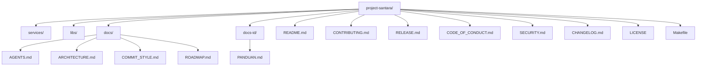

# Project Santara: An Open-Source Counterfactual Microservices Platform for Simulating Indonesia's Economic, Political, and Climate Systems

An open-source counterfactual microservices platform that answers "what if" questions about Indonesia's economic, political, and climate systems. Python services handle language-model reasoning and protocol exposure. A Go service runs the simulation tick engine. A shared Python library called `sim-kernel` provides the domain models, event schemas, and protocol helpers. The project is under active development. The codebase is being rebuilt from scratch. The new structure under `services/` and `libs/` is scaffold only.

For the Indonesian version, see [PANDUAN.md](./docs-id/PANDUAN.md).

## Table of Contents

1. What is Santara
2. Why Santara Exists
3. Current State
4. Quick Start
5. Core Services
6. Use Cases
7. Architecture
8. Tech Stack
9. Repository Layout
10. Documentation
11. Contributing
12. License
13. Citation

## 1. What is Santara

Project Santara is a small constellation of services that simulate real-world systems under stress. The first four sim-id services focus on Indonesia: fiscal stress test, political dynamics, climate emergency, and agrarian micro-economy. A shared library called `sim-kernel` provides the domain models, event schemas, A2A Agent Cards, and MCP tool base. Every service is an independent package with its own `pyproject.toml` (for Python) or `go.mod` (for Go).

The platform is built in two tiers. The Python tier handles language-model reasoning, HTTP APIs, A2A endpoints, MCP tools, and data ingestion from public sources. The Go tier handles the actual tick simulation. The two tiers communicate over gRPC. Both tiers are necessary.

## 2. Why Santara Exists

Indonesia in mid-2026 is experiencing compounding shocks: a currency at historic lows, a stock market in correction, an emergency rate hike cycle, a fuel price jump that triggered student protests, a flagship nutrition program under corruption investigation, and a climate forecast of severe El Nino. Policy makers, journalists, and citizens need tools that let them ask "what if" questions and get answers grounded in real data, fast, and without requiring a research grant.

Existing tools either focus on social media prediction (mirofish, OASIS) or on generic agent frameworks (LangGraph, Pydantic AI). None of them address Indonesia's live economic and political stress with verifiable, open-source, locally deployable infrastructure. Santara tries to fill that gap. The attempt may not succeed.

## 3. Current State

The project is at v0.1.0 (pre-alpha). The first working release of the Python intelligence tier and the Go performance tier is shipped. The first anchor problem (Pertamax 30 percent shock) is answered end to end. See [CHANGELOG.md](./CHANGELOG.md) v0.1.0 entry for the full release notes and v0.0.0 entry for the reset rationale.

What is built:

- `libs/sim-kernel/`: nine modules implemented (`models`, `events`, `errors`, `locales`, `telemetry`, `a2a`, `mcp`, `prompts`, `grpc_contracts`), 21 tests pass, 88% line coverage
- `services/sim-engine/`: Go gRPC server implementing all 9 RPCs from `libs/rpc-contracts/proto/simulation.proto`, in-memory state store, tick engine (counter in v0.1.0), 4 Go tests pass
- `services/sim-gateway/`: FastAPI app with `GET /healthz`, `GET /.well-known/agent-card.json`, `POST /a2a`, JWT bearer validation, forwards questions to sim-id-fiskal, 7 tests pass
- `services/sim-id-fiskal/`: FastAPI app with `GET /healthz` and `POST /ask`, pass-through fiscal model (Pertamax 10%, Pertalite 30%, Solar 20%), answers the first anchor question, 7 tests pass
- `libs/rpc-contracts/proto/simulation.proto`: 10 RPCs, 11 messages, the canonical gRPC contract
- `libs/rpc-contracts/python/`: generated Python stubs, integration test that starts the Go binary and exercises all 9 RPCs (5 tests pass)
- Root `docker-compose.yml`: brings up sim-engine, sim-gateway, sim-id-fiskal
- `.github/workflows/ci.yml`: Python lint+test and Go build+test on push and pull requests
- Root `Makefile`: convenience targets for install, test, lint, build, docker, proto generation, dataset build/push
- `libs/sim-datasets/id_fiscal_pressure/`: curated dataset, 56,709 rows, 69 indicators, 2014-11-18 to 2026-06-10, published to Hugging Face as `raihanpka/indonesia-fiscal-pressure`
- Documentation under `docs/` (English) and `docs-id/` (Indonesian), including `ARCHITECTURE.md`, `ROADMAP.md`, `AGENTS.md`, `COMMIT_STYLE.md`

What is not yet built:

- The real tick engine: v0.1.0 ticks are counters, not simulations
- The other sim-id services: politik, iklim, agraria are still scaffolds
- The Hugging Face dataset is published but not yet wired into the runtime services
- Persistent state: in-memory only, PostgreSQL via pgx planned for v1.5.0
- The gRPC healthcheck in the Docker image is not yet installed
- The dashboard (sim-dashboard) is not yet scaffolded

See [docs/ROADMAP.md](./docs/ROADMAP.md) for the full plan and timeline.

## 4. Quick Start

You need Docker and Docker Compose on a machine with at least 4 GB of free RAM. You need a Go toolchain (1.22+) if you want to build the simulation engine from source. You need a Python 3.12 toolchain and `uv` if you want to build the Python services from source.

```
git clone https://github.com/raihanpka/project-santara
cd project-santara
make install
make test
```

The `make install` target installs sim-kernel and every Python service that has a `pyproject.toml` (sim-id-fiskal, sim-gateway). The `make test` target runs the Python test suite, the Go test suite, and the Python integration test against the Go binary.

To bring up the Docker Compose stack:

```
make docker-up
```

The services are reachable as follows.

- sim-gateway at http://localhost:8000 with OpenAPI docs and an A2A endpoint at `POST /a2a`
- sim-id-fiskal at http://localhost:8001 with OpenAPI docs
- sim-engine (Go gRPC) at localhost:50052

The other sim-id services (politik, iklim, agraria) are planned for Phase 2 and Phase 4. The dashboard is optional throughout.

To ask the first anchor question against the running stack:

```
curl -X POST http://localhost:8000/a2a \
  -H "Authorization: Bearer $(python -c 'import jwt,time; print(jwt.encode({\"sub\":\"test\"}, \"ponytail: dev only, replace in prod\", algorithm=\"HS256\"))')" \
  -H "Content-Type: application/json" \
  -d '{"jsonrpc":"2.0","id":"1","method":"ask","params":{"question":"Apa yang terjadi ke inflasi kalau Pertamax naik 30 persen lagi?"}}'
```

## 5. Core Services

| Service | Language | Tier | What it does | Status |
|---|---|---|---|---|
| sim-kernel | Python (library) | Shared | Pydantic models, event schemas, MCP base, A2A base, locales, prompts, telemetry, errors, grpc_contracts | v0.1.0, 9 modules, 21 tests, 88% coverage |
| sim-engine | Go 1.22+ | Performance | Tick simulation, agent state, market dynamics, gRPC server | v0.1.0, 9 RPCs implemented, 4 Go tests pass, tick is a counter |
| sim-gateway | Python 3.12 | Intelligence | A2A router, MCP server hub, JWT auth, WebSocket telemetry | v0.1.0, FastAPI, 7 tests pass, MCP hub is a placeholder |
| sim-id-fiskal | Python 3.12 | Intelligence | Indonesia fiscal stress test, rupiah shock, BI rate impact, BBM impact, subsidi allocation | v0.1.0, FastAPI, 7 tests pass, pass-through model, first anchor problem |
| sim-id-politik | Python 3.12 | Intelligence | Indonesia political dynamics, kabinet reshuffle, demo propagation, electoral scenarios | Phase 2, scaffold only |
| sim-id-iklim | Python 3.12 | Intelligence | Indonesia climate emergency, El Nino projection, karhutla cascade, banjir response | Phase 2, scaffold only |
| sim-id-agraria | Python 3.12 | Intelligence | Indonesia agrarian micro-economy, tengkulak chain, Reforma Agraria scenarios | Phase 4, scaffold only |
| sim-dashboard | TypeScript | Optional | React 19 and Tailwind v4 web UI | Phase 3, not yet scaffolded |

The v0.1.0 release ships sim-engine (with the gRPC server implemented), sim-kernel (with all modules implemented), sim-gateway, and sim-id-fiskal. The other sim-id services follow in Phase 2 and Phase 4. The dashboard is optional throughout.

## 6. Use Cases

The first four anchor problems are derived from live Indonesian events in Q2 2026. They are scenarios, not commitments. Whether the platform can answer them well is a question the public evaluations will answer.

### Anchor 1: Fiscal stress test

Question: "Apa yang terjadi ke inflasi kalau Pertamax naik 30 persen lagi?"

### Anchor 2: Political reaction

Question: "Apa dampak MBG terhadap swing voter di 2029?"

### Anchor 3: Climate cascade

Question: "Kapan karhutla Riau menjadi krisis haze lintas batas?"

### Anchor 4: Agrarian distribution

Question: "Koperasi Desa Merah Putih vs tengkulak, mana yang lebih tinggi kesejahteraannya?"

## 7. Architecture

The architecture is documented in detail in [docs/ARCHITECTURE.md](./docs/ARCHITECTURE.md). The short version.

- Two tiers: Python intelligence tier plus Go performance tier
- Five to seven small Python services, each under 1,500 lines of its own logic
- One Go service at `services/sim-engine/` doing the tick simulation
- sim-kernel shared Python library, the only thing every Python service imports
- A2A Protocol (Linux Foundation) for inter-service questions between Python services
- gRPC for the Python to Go boundary, using the protobuf contracts in `libs/rpc-contracts/`
- MCP (Linux Foundation) for tool and data exposure
- Redis Streams for events, with the outbox pattern for at-least-once delivery
- PostgreSQL per service, no cross-service joins
- Docker Compose for local and single-node deployment, K3s for multi-node

## 8. Tech Stack

| Layer | Choice | Reason |
|---|---|---|
| Intelligence language | Python 3.12 | Pattern matching, perf, type parameters, hiring pool |
| Performance language | Go 1.22+ | Standard library goroutines, zerolog, low memory footprint |
| Web (Python) | FastAPI + Uvicorn | Async, Pydantic v2 native, OpenAPI free |
| Python to Go boundary | gRPC + Protobuf | Lower latency, strong typing, existing tooling |
| Agent framework | Pydantic AI | Type safe, OTel native, A2A and MCP built in |
| Tick engine | Custom Go at services/sim-engine | Go fits the hot loop |
| LLM default local | Llama 4 8B Instruct | Single consumer GPU, Apache 2.0 |
| LLM default Bahasa | Sahabat-AI 70B | Best open-source Bahasa model, on Hugging Face |
| LLM cloud | Anthropic Claude, OpenAI GPT | Opt-in via API key |
| Inter-service (Python) | A2A Protocol v1.0.1 | Linux Foundation standard |
| Tool and data | MCP with Streamable HTTP | Linux Foundation standard |
| Event bus | Redis 7 Streams | At-least-once via outbox, single binary |
| Database | PostgreSQL 16 per service | No shared schema, no joins |
| Driver (Python) | asyncpg | Native async, no ORM |
| Driver (Go) | pgx (planned for persistent state) | Standard for Go |
| Telemetry | OpenTelemetry + Structlog + zerolog | Vendor neutral, Grafana compatible |
| Tests | pytest + httpx + respx (Python), testing + testify (Go) | Standard, async-capable |
| Deployment | Docker Compose, K3s | Local-first, single binary upgrade path |
| Datasets | Hugging Face Hub | Curated, real data, AI as curator |
| Python library | PyPI | pip install sim-kernel |
| Docker images | GitHub Container Registry | Native to GitHub, multi-arch, free |
| License | Apache 2.0 (new code) | Explicit patent grant, commercial friendly |

## 9. Repository Layout



For the detailed layout of each service and library, see the README at the root of that directory.

## 10. Documentation

- [docs/ROADMAP.md](./docs/ROADMAP.md) - phased roadmap, decision log
- [docs/ARCHITECTURE.md](./docs/ARCHITECTURE.md) - canonical architecture, service map, tech stack
- [docs/AGENTS.md](./docs/AGENTS.md) - guidance for AI coding assistants
- [docs/COMMIT_STYLE.md](./docs/COMMIT_STYLE.md) - commit message convention derived from git history
- [docs-id/PANDUAN.md](./docs-id/PANDUAN.md) - Indonesian version of this README
- [RELEASE.md](./RELEASE.md) - versioning and packaging strategy
- [CONTRIBUTING.md](./CONTRIBUTING.md) - how to contribute, code style, PR process
- [CODE_OF_CONDUCT.md](./CODE_OF_CONDUCT.md) - community standards
- [SECURITY.md](./SECURITY.md) - how to report vulnerabilities
- [CHANGELOG.md](./CHANGELOG.md) - release history

## 11. Contributing

We welcome contributions in code, documentation, translation, scenarios, bug reports, and feature proposals. The full contributor guide is in [CONTRIBUTING.md](./CONTRIBUTING.md). The short version.

1. Read the [Code of Conduct](./CODE_OF_CONDUCT.md)
2. Read [docs/ARCHITECTURE.md](./docs/ARCHITECTURE.md) and [docs/ROADMAP.md](./docs/ROADMAP.md)
3. Look for issues labeled `good first issue` or `help wanted`
4. Open a draft pull request early to get feedback
5. Run the full test suite before requesting review

## 12. License

Project Santara is licensed under the Apache License 2.0. The full license text is in the [LICENSE](./LICENSE) file at the repository root. The Apache 2.0 license includes an explicit patent grant, allows commercial use, and requires preservation of the copyright notice and the license terms in any redistribution. The previous GNU GPL 3.0 text inherited from the legacy codebase has been removed. See [CHANGELOG.md](./CHANGELOG.md) v0.0.0 entry for the full license history.

## 13. Citation

If you use Project Santara in academic work, please cite the platform as follows.

```bibtex
@misc{project-santara-2026,
  author = {Raihan Putra Kirana},
  title  = {Project Santara: An Open-Source Counterfactual Microservices Platform for Simulating Indonesia's Economic, Political, and Climate Systems},
  year   = {2026},
  url    = {https://github.com/raihanpka/project-santara}
}
```

For datasets hosted on the Hugging Face Hub, cite the dataset card directly. Each dataset card includes a citation block with the source URLs and the version of the loader that produced it.
