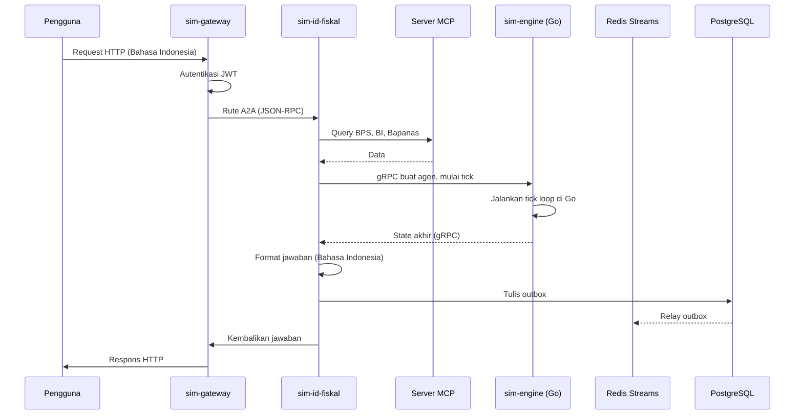

# Project Santara: Architecture

Dokumen ini adalah sumber kanonik tentang bagaimana Project Santara dibangun. Dokumen ini jujur tentang apa yang dibangun hari ini, apa yang sedang dibangun, dan apa yang aspirasional. Project sedang dalam pengembangan aktif. Codebase sedang dibangun ulang dari nol. Struktur baru di bawah `services/` dan `libs/` adalah scaffold saja.

## Daftar Isi

1. Filosofi
2. Gambaran Sistem
3. Peta Layanan
4. Layout Repositori
5. Tech Stack
6. Aliran Data
7. Komunikasi Antar Layanan
8. Spesifikasi Library sim-kernel
9. Dukungan Bilingual dan Locale
10. Model Persistensi
11. Deployment
12. Model Keamanan
13. Target Performa
14. Strategi Testing
15. Observability
16. Architecture Decision Records
17. Dataset Terkurasi

## 1. Filosofi

Arsitektur mengikuti enam aturan.

- **Hybrid microservices, bukan monorepo.** Layanan Python menangani penalaran bahasa-model dan paparan protokol. Layanan Go menangani loop tick simulasi. Masing-masing adalah paket independen dengan test sendiri, Docker image sendiri, dan siklus deployment sendiri.
- **Library first, service second.** Kode Python bersama tinggal di `sim-kernel`, library pip-installable. Kode Go adalah modul terpisah. Keduanya berkomunikasi lewat gRPC.
- **Standar terbuka, tanpa format wire proprietari.** Layanan berbicara A2A Protocol (Linux Foundation) untuk pertanyaan antar layanan dan Model Context Protocol (Linux Foundation) untuk paparan tool dan data. gRPC digunakan secara internal di mana protokol punya manfaat yang jelas.
- **Local-first secara default.** Setiap layanan berjalan di laptop developer dengan `docker compose up` dalam waktu di bawah 60 detik. Layanan cloud adalah convenience opt-in, bukan kebutuhan.
- **Kode bilingual, bukan patch bilingual.** Semua string yang menghadap pengguna, system prompt, dan dokumentasi hidup dalam Bahasa Inggris dan Bahasa Indonesia. Kedua bahasa adalah kelas satu.
- **Jujur tentang status.** Ini proyek alpha. Beberapa bagian dari dokumen ini menjelaskan apa yang sedang dibangun, bukan apa yang dikirim. Lihat ROADMAP.md untuk apa yang selesai, apa yang sedang berjalan, dan apa yang aspirasional.

## 2. Gambaran Sistem

Project Santara adalah konstelasi kecil layanan dalam dua tier.

- **Tier intelligence (Python).** sim-gateway, sim-id-fiskal, sim-id-politik, sim-id-iklim, sim-id-agraria. Layanan ini menangani HTTP, A2A, MCP, penalaran LLM, dan ingestion data. Masing-masing adalah proses FastAPI dengan `pyproject.toml` sendiri.
- **Tier performance (Go).** sim-engine. Layanan ini menjalankan tick simulasi aktual. Ia memiliki state agen, dinamika pasar, dan worker pool. Layanan Go adalah satu modul Go di `services/sim-engine/`.

Dua tier berkomunikasi lewat gRPC. Layanan Python melakukan penalaran dan mengorkestrasi skenario. Layanan Go melakukan hot loop. Keduanya diperlukan. Proyek ini bukan proyek Python-only atau Go-only. Ini hybrid.

Persistensi adalah PostgreSQL per layanan. Tidak ada ORM bersama, tidak ada join lintas layanan, dan tidak ada transaksi terdistribusi. Event mengalir lewat Redis Streams dengan pola outbox.

## 3. Peta Layanan

```mermaid
flowchart TB
    subgraph Public["Klien Publik"]
        Browser[Browser]
        Curl[curl]
        MCP_Client[MCP Client]
        A2A_Client[A2A Client]
    end

    subgraph Gateway["sim-gateway :8000 (Python, Fase 1)"]
        Gateway["Router A2A, hub MCP,<br/>autentikasi JWT,<br/>telemetri WebSocket opsional"]
    end

    subgraph Intelligence["Tier Intelligence (Python)"]
        Fiskal["sim-id-fiskal :8001<br/>Fase 1, Anchor 1"]
        Politik["sim-id-politik :8002<br/>Fase 2, Anchor 2"]
        Iklim["sim-id-iklim :8003<br/>Fase 2, Anchor 3"]
        Agraria["sim-id-agraria :8004<br/>Fase 4, Anchor 4"]
    end

    subgraph Performance["Tier Performance (Go)"]
        Engine["sim-engine :50052 (Go)<br/>Fase 0 scaffold,<br/>tick engine, worker pool"]
    end

    subgraph Shared["Library Bersama"]
        Kernel["sim-kernel (PyPI)<br/>Fase 0 scaffold, modul belum diimplementasi<br/>Model Pydantic, events,<br/>MCP base, A2A base, locale"]
    end

    subgraph Infrastructure["Infrastruktur"]
        Redis[("Redis 7<br/>Streams")]
        PG[("PostgreSQL 16<br/>per layanan")]
    end

    Browser --> Gateway
    Curl --> Gateway
    MCP_Client --> Gateway
    A2A_Client --> Gateway

    Gateway -->|A2A JSON-RPC| Fiskal
    Gateway -->|A2A JSON-RPC| Politik
    Gateway -->|A2A JSON-RPC| Iklim
    Gateway -->|A2A JSON-RPC| Agraria

    Fiskal -->|gRPC| Engine
    Politik -->|gRPC| Engine
    Iklim -->|gRPC| Engine
    Agraria -->|gRPC| Engine

    Fiskal -.->|uses| Kernel
    Politik -.->|uses| Kernel
    Iklim -.->|uses| Kernel
    Agraria -.->|uses| Kernel
    Gateway -.->|uses| Kernel

    Fiskal --> Redis
    Fiskal --> PG
    Politik --> PG
    Iklim --> PG
    Agraria --> PG
    Gateway --> PG
```

### Inventaris Layanan

| Layanan | Bahasa | Tier | Fungsi | Port Default | Status |
|---|---|---|---|---|---|
| sim-kernel | Python (library) | Bersama | Model Pydantic, skema event, basis MCP, basis A2A, locale | n/a | Fase 0 scaffold, `pyproject.toml` dipublikasikan, modul belum diimplementasi |
| sim-engine | Go | Performance | Tick simulasi, state agen, dinamika pasar, worker pool, server gRPC | 50052 | Fase 0 scaffold, `go.mod` dipublikasikan, belum ada kode Go |
| sim-gateway | Python | Intelligence | Router A2A, hub server MCP, autentikasi JWT, telemetri WebSocket | 8000 | Fase 1, scaffold saja |
| sim-id-fiskal | Python | Intelligence | Stress test fiskal Indonesia (rupiah, BI rate, BBM, subsidi) | 8001 | Fase 1, scaffold saja, masalah jangkar pertama |
| sim-id-politik | Python | Intelligence | Dinamika politik Indonesia (kabinet, demo, electoral) | 8002 | Fase 2, scaffold saja |
| sim-id-iklim | Python | Intelligence | Darurat iklim Indonesia (El Nino, karhutla, banjir) | 8003 | Fase 2, scaffold saja |
| sim-id-agraria | Python | Intelligence | Mikro-ekonomi agraria Indonesia (tengkulak, Reforma Agraria) | 8004 | Fase 4, scaffold saja |
| sim-dashboard | TypeScript | Opsional | Web UI dengan React 19 dan Tailwind v4 | 3000 | Fase 3, belum di-scaffold |

Rilis v0.1.0 mengirimkan sim-engine (dengan server gRPC diimplementasi), sim-kernel (dengan semua modul diimplementasi), sim-gateway, dan sim-id-fiskal. Layanan sim-id lainnya menyusul di Fase 2 dan Fase 4. Dashboard opsional di seluruh fase.

## 4. Layout Repositori

```mermaid
flowchart TB
    Root[project-santara/]
    Root --> Services[services/]
    Root --> Libs[libs/]
    Root --> Docs[docs/]
    Root --> DocsId[docs-id/]
    Root --> Readme[README.md]
    Root --> Contributing[CONTRIBUTING.md]
    Root --> Release[RELEASE.md]
    Root --> Coc[CODE_OF_CONDUCT.md]
    Root --> Security[SECURITY.md]
    Root --> Changelog[CHANGELOG.md]
    Root --> License[LICENSE]
    Root --> Makefile[Makefile]
    Docs --> AgentsMd[AGENTS.md]
    Docs --> ArchMd[ARCHITECTURE.md (file ini)]
    Docs --> CommitStyle[COMMIT_STYLE.md]
    Docs --> RoadmapMd[ROADMAP.md]
    DocsId --> Panduan[PANDUAN.md]
```

Layout detail untuk setiap layanan dan library ada di README masing-masing di root direktori tersebut.

## 5. Tech Stack

Stack dipilih untuk kematangan, hiring pool, dan jejak ops minimal. Setiap teknologi punya alasan tertulis di log keputusan di ROADMAP.md atau di ADR.

### 5.1 Bahasa dan Runtime

- **Python 3.12** sebagai bahasa tier intelligence. Pattern matching, type parameter, dan perf group stabil.
- **Go 1.22 atau lebih baru** sebagai bahasa tier performance. Kode sim-engine menggunakan pustaka standar dan zerolog. Tidak ada dependensi eksotik.
- **TypeScript 5.x** hanya untuk sim-dashboard opsional. Tidak ada JavaScript lain.
- **SQL** untuk query PostgreSQL. Tidak ada ORM. Layer query menggunakan `asyncpg` dengan SQL mentah plus helper repository tipis.

### 5.2 Web dan API

- **FastAPI** sebagai satu-satunya framework web Python. Pydantic v2 digunakan untuk model request dan response.
- **Uvicorn** sebagai server ASGI. Gunicorn tidak digunakan.
- **gRPC** untuk batas Python ke Go. Kontrak protobuf di `libs/rpc-contracts/proto/simulation.proto`. Layanan Go adalah server gRPC; layanan Python adalah client gRPC.
- **HTTPX** untuk HTTP internal dan test integrasi.

### 5.3 Agen dan LLM

- **Pydantic AI** untuk definisi agen type-safe. OTel native, client MCP dan A2A built in.
- **Sahabat-AI** sebagai model Bahasa Indonesia default. Open source di Hugging Face.
- **Llama 4 8B Instruct** sebagai model lokal default. Berjalan di single consumer GPU.
- **Anthropic Claude dan OpenAI GPT** sebagai provider cloud opt-in untuk penalaran lanjutan. API key saja.

### 5.4 Simulasi

- **Mesa 4.0** sebagai framework agent-based modeling Python. Opsional, digunakan untuk analisis tingkat riset setelah engine tick Go berjalan.
- **Custom Go tick engine** di `services/sim-engine/`. Atomic counter, worker pool, state in-memory, server gRPC. Layanan Go adalah satu-satunya yang menjalankan tick.
- **Pandas** untuk analisis data di laporan post-mortem.
- **NumPy** untuk primitif simulasi numerik.

### 5.5 Komunikasi Antar Layanan

- **A2A Protocol v1.0.1** untuk pertanyaan antar layanan sinkron antara layanan Python. Standar Linux Foundation. Transport adalah JSON-RPC over HTTP.
- **Model Context Protocol** dengan transport Streamable HTTP dan OAuth 2.1 untuk paparan tool dan data. Standar Linux Foundation.
- **gRPC** untuk batas Python ke Go. Kontrak yang didefinisikan Protobuf. Latency lebih rendah dari JSON-RPC, typing kuat.
- **Redis Streams** untuk event asinkron antara layanan Python. Pola outbox di setiap layanan untuk menjamin pengiriman at-least-once.

### 5.6 Data dan State

- **PostgreSQL 16** sebagai satu-satunya store persisten. Satu database per layanan. Tidak ada join lintas database.
- **Redis 7** untuk Streams, lock ephemeral, dan state sesi jangka pendek. Tidak ada storage jangka panjang.
- **asyncpg** sebagai driver PostgreSQL untuk Python.
- **redis-py** sebagai client Redis.
- **Pydantic v2** untuk semua model data Python, termasuk model baris database.
- **Go database/sql** dengan driver pgx untuk layanan Go, jika pernah perlu persist state. Saat ini in-memory saja.

### 5.7 Deployment

- **Docker** dan **Docker Compose** untuk pengembangan lokal dan deployment single-node.
- **K3s** sebagai orkestrator multi-node yang direkomendasikan. Tidak ada Kubernetes penuh di v1.0.
- **GHCR** (GitHub Container Registry) untuk hosting image publik.
- **PyPI** untuk distribusi sim-kernel.
- **Hugging Face Hub** untuk distribusi dataset terkurasi. Lihat bagian 17.

### 5.8 Observability

- **OpenTelemetry** untuk trace, metric, dan log. Setiap layanan menggunakan OTel SDK.
- **zerolog** untuk logging Go terstruktur.
- **Structlog** untuk logging Python terstruktur.
- **Grafana** untuk dashboard. Loki untuk log. Tempo untuk trace. Prometheus untuk metric.
- **Sentry** sebagai opt-in untuk pelaporan error. Dinonaktifkan secara default untuk privasi.

### 5.9 Testing

- **pytest** untuk test unit dan integrasi Python.
- **pytest-asyncio** untuk kasus test async.
- **httpx** untuk testing HTTP async.
- **respx** untuk mocking panggilan HTTP eksternal di test.
- **Go testing** pustaka standar dan testify untuk layanan Go.
- **coverage** untuk cakupan kode Python, ditegakkan di 80 persen pada sim-kernel dan 70 persen pada setiap layanan Python.
- Cakupan pada layanan Go tidak ditegakkan sebagai gate keras. Test integrasi menjalankan engine tick Go end to end dengan caller gRPC Python riil.

### 5.10 Locale Bilingual

- **PyYAML** untuk loading preset locale.
- **Babel** untuk manajemen katalog pesan jika volume terjemahan tumbuh.
- **File data locale** di sim-kernel untuk ID, US, IN, PH di v1.0, dengan hook untuk menambah lebih banyak.

## 6. Aliran Data

Aliran end-to-end kanonik adalah skenario stress test fiskal. Pengguna bertanya dalam Bahasa Indonesia: "Apa yang terjadi ke inflasi kalau Pertamax naik 30 persen lagi?"



Path lengkap adalah target di bawah 30 detik untuk satu skenario. Ini target, bukan hasil terukur.

## 7. Komunikasi Antar Layanan

Empat saluran, empat aturan.

- **A2A untuk pertanyaan antara layanan Python.** Gunakan A2A Protocol ketika satu layanan Python membutuhkan jawaban dari layanan Python lain. Transport adalah JSON-RPC over HTTP. Setiap layanan memublikasikan Agent Card statis di `/.well-known/agent-card.json`.
- **MCP untuk tool dan data.** Gunakan Model Context Protocol ketika layanan mengekspos tool atau data ke agen (manusia atau mesin). Setiap layanan memublikasikan server MCP-nya di `/mcp`.
- **gRPC untuk batas Python ke Go.** Gunakan gRPC ketika layanan Python membutuhkan engine tick Go. Kontrak protobuf ada di `libs/rpc-contracts/proto/simulation.proto`.
- **Redis Streams untuk event.** Gunakan Redis Streams untuk event fire-and-forget antara layanan Python. Pola outbox menjamin pengiriman at-least-once. Konsumen harus idempotent.

Jangan perkenalkan saluran kelima di v1.0. Disiplin lebih penting daripada kenyamanan.

## 8. Spesifikasi Library sim-kernel

sim-kernel adalah satu-satunya library Python yang diandalkan setiap layanan. Ia pip-installable sebagai `sim-kernel`. Ia tidak mengandung I/O sendiri. Setiap fungsi murni atau menerima dependensinya sebagai argumen.

### Modul Publik

| Modul | Fungsi |
|---|---|
| sim_kernel.models | Model Pydantic untuk domain inti (Agent, Market, Region, Event, FiscalShock, PoliticalShock, ClimateShock) |
| sim_kernel.events | Envelop event, helper event bus, helper pola outbox |
| sim_kernel.a2a | Generator AgentCard, client A2A, basis server A2A |
| sim_kernel.mcp | MCPServerBase, dekorator tool, helper JSON schema |
| sim_kernel.locales | Preset locale untuk ID, US, IN, PH, dengan nama mata uang dan level admin |
| sim_kernel.prompts | Template system prompt Bahasa Indonesia dan Bahasa Inggris untuk peran agen |
| sim_kernel.telemetry | Helper tracer dan meter OpenTelemetry |
| sim_kernel.errors | Slug error standar (ErrAgentNotFound, ErrSimFailed, dan seterusnya) |
| sim_kernel.grpc_contracts | Stub Python yang dihasilkan dari kontrak protobuf |

### Versioning

sim-kernel mengikuti Semantic Versioning secara ketat. Perubahan breaking memerlukan major version bump. Layanan pin ke rentang versi minor, tidak pernah rentang major.

## 9. Dukungan Bilingual dan Locale

Setiap string yang menghadap pengguna hidup di dua tempat: sumber Bahasa Inggris dan terjemahan Bahasa Indonesia. File terjemahan di-check in bersama sumber. Preset locale tinggal di sim-kernel dan di-load saat startup layanan.

Layanan bisa menjawab dalam tiga bahasa: Bahasa Inggris (default), Bahasa Indonesia (id), dan bahasa request pengguna. System prompt di-load dari sim-kernel.prompts menggunakan locale pengguna.

Versi Bahasa Inggris dari dokumen internal ada di `docs/`. Versi Bahasa Indonesia ada di `docs-id/`. Kedua direktori tetap sinkron.

## 10. Model Persistensi

Setiap layanan memiliki database PostgreSQL sendiri. Join lintas layanan dilarang. Pembagian data lintas layanan terjadi lewat A2A atau MCP, tidak pernah lewat database bersama.

Pola outbox wajib untuk setiap perubahan state yang perlu menghasilkan event. Perubahan state dan baris outbox ditulis dalam transaksi yang sama. Proses relay membaca outbox dan mempublikasikan ke Redis Streams.

Migrasi dikelola dengan file SQL mentah di `migrations/` per layanan. Tidak ada Alembic, tidak ada Prisma, tidak ada Flyway. Runner migrasi adalah script kecil di sim-kernel.

Layanan Go saat ini berjalan in-memory saja. State persisten untuk layanan Go adalah fitur v1.5.0. Jika layanan Go crash di tengah simulasi, simulasi hilang. Ini dapat diterima untuk sekarang karena layanan Python memiliki state durable dan layanan Go diperlakukan sebagai simulator stateless.

## 11. Deployment

### Pengembangan Lokal

```
docker compose up
```

Ini menghadirkan layanan v0.1.0 ditambah Redis dan PostgreSQL. Boot penuh memiliki target di bawah 60 detik di laptop developer dengan Docker Desktop. Waktu boot aktual belum diukur.

### Produksi Single-Node

File Docker Compose yang sama, dengan satu perubahan environment file, berjalan di single VPS. VPS yang direkomendasikan adalah 4 vCPU, 8 GB RAM, 80 GB SSD. Target biaya di bawah USD 30 per bulan dari penyedia cloud besar manapun. Ini target, bukan hasil terukur.

### Produksi Multi-Node

K3s adalah orkestrator yang direkomendasikan. Setiap layanan mengirim manifes Kubernetes. Relay outbox dan hub MCP berjalan sebagai container sidecar. Ini fitur v1.5.0.

## 12. Model Keamanan

- **JWT** di gateway untuk autentikasi pengguna. RS256 dengan kunci yang berotasi.
- **OAuth 2.1** untuk server MCP ketika diakses oleh client pihak ketiga.
- **mTLS** untuk traffic antar layanan di v1.0. Capability token di v2.0.
- **Tidak ada secret di environment variable di produksi.** Secret di-load dari Docker secret atau secret manager.
- **Lisensi memungkinkan penggunaan komersial.** Apache 2.0 cukup permissive untuk integrasi yang masuk akal, dengan grant paten eksplisit. Teks lisensi lengkap ada di file LICENSE di root repositori.

## 13. Target Performa

Ini target, bukan hasil terukur.

| Metrik | Target | Status |
|---|---|---|
| Respons skenario tunggal (fiskal) | Kurang dari 30 detik end to end | Belum diukur |
| Panggilan A2A antar layanan | Kurang dari 500 milidetik p95 | Belum diukur |
| Invocation tool MCP | Kurang dari 200 milidetik p95 | Belum diukur |
| Panggilan gRPC ke layanan Go | Kurang dari 50 milidetik p95 | Belum diukur |
| Throughput engine tick Go | Setidaknya 1.000 tick per detik agen tunggal | Belum diukur |
| Simulasi konkuren per node | Setidaknya 10 | Belum diukur |
| Memori per layanan Python | Kurang dari 512 MB steady state | Belum diukur |
| Memori per layanan Go | Kurang dari 256 MB steady state | Belum diukur |
| Cold start | Kurang dari 5 detik | Belum diukur |

Target bersifat aspirasional. Kami akan mengukur dan memperbarui tabel ini saat proyek stabil.

## 14. Strategi Testing

Tiga lapisan.

- **Test unit** untuk fungsi murni. Target cakupan 80 persen pada sim-kernel, 70 persen pada layanan Python.
- **Test integrasi** untuk batas layanan. Gunakan httpx melawan stack Docker Compose lokal. Tidak ada panggilan API eksternal di test.
- **Test skenario end-to-end** yang dikirim bersama layanan. Setiap skenario adalah file Python yang dapat dijalankan yang membuktikan layanan menjawab pertanyaan riil.

Untuk layanan Go, test integrasi menjalankan server gRPC end to end dengan client gRPC Python riil. Caller Python adalah test harness kecil, bukan layanan produksi.

Data test dikirim sebagai fixture, tidak pernah dihasilkan pada waktu test. Test harus reproducible oleh siapapun dengan repositori.

## 15. Observability

Setiap layanan memancarkan tiga sinyal: log terstruktur, trace OpenTelemetry, dan metric Prometheus. Defaultnya: log level INFO, trace sampling 1.0 di dev, 0.1 di produksi.

Tiga dashboard dikirim dengan platform.

- **Kesehatan layanan.** Request rate, error rate, p50, p95, p99 latency, memori, CPU.
- **Kesehatan simulasi.** Skenario per menit, skenario gagal, panggilan A2A p95, tool MCP p95.
- **Metrik bisnis.** Distribusi skenario per wilayah, per pengguna, per masalah jangkar.

Dashboard belum diimplementasi. OTel SDK akan dipasang di setiap layanan saat diimplementasi.

## 16. Architecture Decision Records

Keputusan arsitektur dilacak di `docs/adr/` sebagai file Markdown bernomor (0001-record-architecture.md, 0002-choose-pydantic-ai.md, dan seterusnya). Setiap ADR memiliki lima bagian yang sama: Context, Decision, Consequences, Alternatives, References. ADR append-only. Membatalkan keputusan memerlukan ADR baru.

Ringkasan log keputusan saat ini ada di `ROADMAP.md`. Penalaran detail tinggal di ADR itu sendiri.

## 17. Dataset Terkurasi

Platform mengirim dataset terkurasi, bukan-AI-generated di Hugging Face Hub. Dataset ini ada untuk membuat simulasi reproducible dan untuk membiarkan peneliti eksternal memverifikasi klaim platform.

### Pendekatan

- **Datanya riil.** Setiap baris dalam dataset Santara bisa dilacak ke sumber publik bernama. Tidak ada nilai yang diimputasi oleh LLM.
- **AI bertindak sebagai kurator.** AI assistant (atau manusia menggunakan AI assistant) menemukan sumber, memvalidasi schema, membersihkan formatting, dan menulis loader. AI tidak mengarang nilai.
- **Provenance wajib.** Setiap dataset memiliki companion `provenance.csv` yang mencatat, untuk setiap baris, URL sumber, timestamp fetch, dan nama kolom asli. Loader memverifikasi provenance pada waktu load dan menolak memuat jika provenance hilang.
- **Lisensi dilestarikan.** Jika sumber memiliki lisensi non-redistribusi, dataset dikirim dengan file `LICENSE-DATA` yang menamai sumber dan lisensinya.

### Dataset yang Direncanakan

| Dataset | Sumber | Status |
|---|---|---|
| Indonesia Fiscal Pressure Tracker | Bank Indonesia, Bapanas PIHPS, DJBC, APBN | Direncanakan (Fase 1) |
| Indonesia BPS Agricultural Time Series | BPS Sensus Pertanian 2023, satudata.pertanian.go.id, FAO FAOSTAT | Direncanakan (Fase 1) |
| Indonesia Political Event Log | BEM UI, BEM berbagai, media, KPU | Direncanakan (Fase 2) |
| Indonesia Climate and Disaster Log | BMKG, BNPB, KLHK SiPongi, NOAA | Direncanakan (Fase 2) |
| Indonesia Agrarian Conflict Map | KPA, Mongabay, Ekuatorial, Bisnis.com | Direncanakan (Fase 4) |
| Indonesia Fuel and Subsidy Tracker | Pertamina, BPH Migas, ESDM | Direncanakan (Fase 4) |

Dataset dideploy di bawah organisasi `raihanpka` (atau ekuivalen) Hugging Face. Proses deployment adalah script Python di `libs/sim-datasets/` yang mengambil, memvalidasi, mengemas, dan mendorong ke Hub. Lihat [RELEASE.md](../../RELEASE.md) untuk strategi distribusi lengkap.

### Mengapa Ini Penting

Kritik umum terhadap platform simulasi adalah "kami mengarang angka untuk membuat demo terlihat bagus." Publikasi dataset adalah jawaban untuk kritik itu. Siapapun dengan dataset bisa menjalankan simulasi mereka sendiri, memverifikasi angka platform, dan mempublikasikan kritik atau perbaikan mereka sendiri.

Ini juga bagaimana platform mendapatkan kepercayaan seiring waktu. Kepercayaan bukan klaim pemasaran. Kepercayaan adalah catatan diperiksa dan tidak salah.
