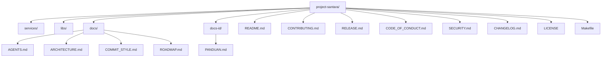

# Project Santara: Platform Microservice Counterfactual Sumber Terbuka untuk Simulasi Sistem Ekonomi, Politik, dan Iklim Indonesia

Platform microservice counterfactual sumber terbuka yang menjawab pertanyaan "bagaimana jika" tentang sistem ekonomi, politik, dan iklim Indonesia. Layanan Python menangani penalaran model bahasa dan paparan protokol. Layanan Go menjalankan tick engine simulasi. Library Python bersama bernama `sim-kernel` menyediakan model domain, skema event, dan pembantu protokol. Project sedang dalam pengembangan aktif. Codebase sedang dibangun ulang dari nol. Struktur baru di bawah `services/` dan `libs/` adalah scaffold saja.

Untuk versi Bahasa Inggris, lihat [README.md](../README.md).

## 14. Sitasi

Jika Anda merujuk Project Santara dalam karya akademis atau teknis, sitasi platform sebagai berikut.

```bibtex
@misc{project-santara-2026,
  author = {Raihan Putra Kirana},
  title  = {Project Santara: An Open-Source Counterfactual Microservices Platform for Simulating Indonesia's Economic, Political, and Climate Systems},
  year   = {2026},
  url    = {https://github.com/raihanpka/project-santara}
}
```

## Daftar Isi

1. Apa itu Santara
2. Mengapa Santara Ada
3. Status Saat Ini
4. Mulai Cepat
5. Layanan Inti
6. Skenario Penggunaan
7. Arsitektur
8. Tech Stack
9. Layout Repositori
10. Dokumentasi
11. Kontribusi
12. Lisensi
13. Sitasi

## 1. Apa itu Santara

Project Santara adalah konstelasi kecil layanan yang mensimulasikan sistem dunia nyata dalam tekanan. Empat layanan sim-id pertama fokus pada Indonesia: stress test fiskal, dinamika politik, darurat iklim, dan mikro-ekonomi agraria. Library bersama bernama `sim-kernel` menyediakan model domain, skema event, A2A Agent Card, dan basis tool MCP. Setiap layanan adalah paket independen dengan `pyproject.toml` sendiri (untuk Python) atau `go.mod` sendiri (untuk Go).

Platform ini dibangun dalam dua tier. Tier Python menangani penalaran bahasa-model, API HTTP, endpoint A2A, tool MCP, dan ingestion data dari sumber publik. Tier Go menangani tick simulasi aktual. Dua tier ini berkomunikasi lewat gRPC. Kedua tier diperlukan.

## 2. Mengapa Santara Ada

Indonesia di pertengahan 2026 mengalami guncangan berlapis: kurs rupiah di level terendah sejarah, pasar saham terkoreksi, siklus kenaikan suku bunga darurat, lonjakan harga BBM yang memicu demonstrasi mahasiswa, program nutrisi unggulan di bawah investigasi korupsi, dan prakiraan iklim El Nino parah. Pembuat kebijakan, jurnalis, dan warga butuh alat yang memungkinkan mereka bertanya "bagaimana jika" dan mendapat jawaban yang berdasar pada data riil, dengan cepat, dan tanpa harus mengajukan hibah penelitian.

Alat yang ada saat ini fokus pada prediksi media sosial (mirofish, OASIS) atau pada framework agen generik (LangGraph, Pydantic AI). Tidak satupun dari mereka yang menjawab stres ekonomi dan politik Indonesia secara langsung dengan infrastruktur sumber terbuka, terverifikasi, dan bisa dipasang secara lokal. Santara mencoba mengisi gap tersebut. Upayanya mungkin tidak berhasil.

## 3. Status Saat Ini

Project di v0.0.0 (pre-alpha). Codebase sedang dibangun ulang dari nol. Struktur baru di bawah `services/` dan `libs/` adalah scaffold saja. Kode legacy di bawah `apps/` sudah dihapus. Lihat [CHANGELOG.md](../CHANGELOG.md) entri v0.0.0 untuk rasional reset lengkap.

Yang sudah dibangun:

- Struktur direktori bersih dengan `services/`, `libs/`, `docs/`, `docs-id/`, root `Makefile`, file root dokumentasi
- `services/sim-engine/` punya `go.mod` untuk `github.com/raihanpka/sim-engine` dan README. Belum ada kode Go.
- `libs/sim-kernel/` punya `pyproject.toml` siap publish. Modul belum diimplementasi.
- `libs/rpc-contracts/` direktori kosong dengan README. Belum ada file `.proto`.
- Root `Makefile` dengan target convenience.
- Dokumentasi di `docs/` (Bahasa Inggris) dan `docs-id/` (Bahasa Indonesia).
- `docs/COMMIT_STYLE.md` dan root `RELEASE.md` mendefinisikan standar commit dan rilis.

Yang belum dibangun:

- Semuanya. Test integrasi dari codebase legacy hilang. Kode engine Go hilang. Kode engine AI Python hilang.

Lihat [docs/ROADMAP.md](../docs/ROADMAP.md) untuk rencana dan timeline lengkap.

## 4. Mulai Cepat

Kamu butuh Docker dan Docker Compose di mesin dengan minimal 4 GB RAM kosong. Kamu butuh toolchain Go jika ingin membangun simulation engine dari source. Kamu butuh toolchain Python 3.12 jika ingin membangun layanan Python dari source.

```
git clone https://github.com/raihanpka/project-santara
cd project-santara
cp .env.example .env
make install
make test
```

Target `make install` menginstal sim-kernel dan layanan Python apapun yang punya `pyproject.toml`. Target `make test` menjalankan test suite Python dan test suite Go (ketika sim-engine punya test).

Untuk menghadirkan stack Docker Compose yang direncanakan (belum diauthor):

```
make docker-up
```

Ketika layanan diimplementasi, mereka akan dapat dicapai sebagai berikut.

- sim-gateway di http://localhost:8000 dengan dokumen OpenAPI
- sim-id-fiskal di http://localhost:8001
- sim-id-politik di http://localhost:8002
- sim-id-iklim di http://localhost:8003
- sim-id-agraria di http://localhost:8004
- sim-engine (Go gRPC) di localhost:50052

Stack Docker Compose belum diauthor. Akan ditambahkan di Fase 0 bersamaan dengan scaffold sim-engine.

## 5. Layanan Inti

| Layanan | Bahasa | Tier | Fungsi | Status |
|---|---|---|---|---|
| sim-kernel | Python (library) | Bersama | Model Pydantic, skema event, basis MCP, basis A2A, locale | Fase 0 scaffold, `pyproject.toml` dipublikasikan, modul belum diimplementasi |
| sim-engine | Go | Performance | Tick simulasi, state agen, dinamika pasar, worker pool, server gRPC | Fase 0 scaffold, `go.mod` dipublikasikan, belum ada kode Go |
| sim-gateway | Python | Intelligence | Router A2A, hub server MCP, autentikasi JWT, telemetri WebSocket | Fase 1, scaffold saja |
| sim-id-fiskal | Python | Intelligence | Stress test fiskal Indonesia, shock rupiah, dampak BI rate, dampak BBM, alokasi subsidi | Fase 1, scaffold saja, masalah jangkar pertama |
| sim-id-politik | Python | Intelligence | Dinamika politik Indonesia, reshuffle kabinet, propagasi demo, skenario electoral | Fase 2, scaffold saja |
| sim-id-iklim | Python | Intelligence | Darurat iklim Indonesia, projeksi El Nino, cascade karhutla, respons banjir | Fase 2, scaffold saja |
| sim-id-agraria | Python | Intelligence | Mikro-ekonomi agraria Indonesia, rantai tengkulak, skenario Reforma Agraria | Fase 4, scaffold saja |
| sim-dashboard | TypeScript | Opsional | Web UI dengan React 19 dan Tailwind v4 | Fase 3, belum di-scaffold |

Rilis v0.1.0 mengirimkan sim-engine (dengan server gRPC diimplementasi), sim-kernel (dengan semua modul diimplementasi), sim-gateway, dan sim-id-fiskal. Layanan sim-id lainnya menyusul di Fase 2 dan Fase 4. Dashboard opsional di seluruh fase.

## 6. Skenario Penggunaan

Empat masalah jangkar (anchor problems) pertama diambil dari peristiwa langsung Indonesia di K2 2026. Mereka adalah skenario, bukan komitmen. Apakah platform bisa menjawabnya dengan baik adalah pertanyaan yang akan dijawab oleh evaluasi publik.

### Anchor 1: Stress test fiskal

Pertanyaan: "Apa yang terjadi ke inflasi kalau Pertamax naik 30 persen lagi?"

### Anchor 2: Reaksi politik

Pertanyaan: "Apa dampak MBG terhadap swing voter di 2029?"

### Anchor 3: Cascade iklim

Pertanyaan: "Kapan karhutla Riau menjadi krisis haze lintas batas?"

### Anchor 4: Distribusi agraria

Pertanyaan: "Koperasi Desa Merah Putih vs tengkulak, mana yang lebih tinggi kesejahteraannya?"

## 7. Arsitektur

Arsitektur didokumentasikan secara lengkap di [docs/ARCHITECTURE.md](../docs/ARCHITECTURE.md). Versi ringkasnya.

- Dua tier: tier intelligence Python ditambah tier performance Go
- Lima sampai tujuh layanan Python kecil, masing-masing di bawah 1.500 baris logika sendiri
- Satu layanan Go di `services/sim-engine/` yang menjalankan tick simulasi
- Library bersama sim-kernel, satu-satunya yang diimpor setiap layanan Python
- A2A Protocol (Linux Foundation) untuk pertanyaan antar layanan Python
- gRPC untuk batas Python ke Go, menggunakan kontrak protobuf di `libs/rpc-contracts/`
- MCP (Linux Foundation) untuk paparan tool dan data
- Redis Streams untuk event, dengan pola outbox untuk pengiriman at-least-once
- PostgreSQL per layanan, tidak ada join lintas layanan
- Docker Compose untuk deployment lokal dan single-node, K3s untuk multi-node

## 8. Tech Stack

| Lapisan | Pilihan | Alasan |
|---|---|---|
| Bahasa intelligence | Python 3.12 | Pattern matching, perf, type parameters, hiring pool |
| Bahasa performance | Go 1.22+ | Goroutine pustaka standar, zerolog, jejak memori rendah |
| Web (Python) | FastAPI + Uvicorn | Async, native Pydantic v2, OpenAPI gratis |
| Batas Python ke Go | gRPC + Protobuf | Latency lebih rendah, typing kuat, tool yang ada |
| Framework agen | Pydantic AI | Type safe, OTel native, A2A dan MCP built in |
| Tick engine | Kode Go kustom di services/sim-engine | Go cocok untuk hot loop |
| LLM default lokal | Llama 4 8B Instruct | Single consumer GPU, Apache 2.0 |
| LLM default Bahasa | Sahabat-AI 70B | Model Bahasa open source terbaik, di Hugging Face |
| LLM cloud | Anthropic Claude, OpenAI GPT | Opt-in via API key |
| Antar layanan (Python) | A2A Protocol v1.0.1 | Standar Linux Foundation |
| Tool dan data | MCP dengan Streamable HTTP | Standar Linux Foundation |
| Event bus | Redis 7 Streams | At-least-once via outbox, single binary |
| Database | PostgreSQL 16 per layanan | Tidak ada skema bersama, tidak ada join |
| Driver (Python) | asyncpg | Native async, tanpa ORM |
| Driver (Go) | pgx (direncanakan untuk state persisten) | Standar untuk Go |
| Telemetri | OpenTelemetry + Structlog + zerolog | Vendor neutral, kompatibel Grafana |
| Test | pytest + httpx + respx (Python), testing + testify (Go) | Standar, async-capable |
| Deployment | Docker Compose, K3s | Local-first, jalur upgrade single binary |
| Dataset | Hugging Face Hub | Terkurasi, data riil, AI sebagai kurator |
| Library Python | PyPI | pip install sim-kernel |
| Docker image | GitHub Container Registry | Native ke GitHub, multi-arch, gratis |
| Lisensi | Apache 2.0 (kode baru) | Grant paten eksplisit, komersial friendly |
| Lisensi legacy | GNU GPL 3.0 (file LICENSE) | Dipertahankan seperti yang di-commit, lihat CHANGELOG |

## 9. Layout Repositori



Untuk layout detail setiap layanan dan library, lihat README di root direktori tersebut.

## 10. Dokumentasi

- [docs/ROADMAP.md](../docs/ROADMAP.md) - roadmap bertahap, log keputusan
- [docs/ARCHITECTURE.md](../docs/ARCHITECTURE.md) - arsitektur kanonik, peta layanan, tech stack
- [docs/AGENTS.md](../docs/AGENTS.md) - panduan untuk asisten coding AI
- [docs/COMMIT_STYLE.md](../docs/COMMIT_STYLE.md) - konvensi pesan commit diturunkan dari riwayat git
- [README.md](../README.md) - versi Bahasa Inggris dari file ini
- [RELEASE.md](../RELEASE.md) - strategi versioning dan packaging
- [CONTRIBUTING.md](../CONTRIBUTING.md) - cara kontribusi, gaya kode, proses PR
- [CODE_OF_CONDUCT.md](../CODE_OF_CONDUCT.md) - standar komunitas
- [SECURITY.md](../SECURITY.md) - cara melaporkan kerentanan
- [CHANGELOG.md](../CHANGELOG.md) - histori rilis

## 11. Kontribusi

Kami menerima kontribusi dalam bentuk kode, dokumentasi, terjemahan, skenario, laporan bug, dan proposal fitur. Panduan lengkap di [CONTRIBUTING.md](../CONTRIBUTING.md). Versi ringkasnya.

1. Baca [Code of Conduct](../CODE_OF_CONDUCT.md)
2. Baca [docs/ARCHITECTURE.md](../docs/ARCHITECTURE.md) dan [docs/ROADMAP.md](../docs/ROADMAP.md)
3. Cari issue berlabel `good first issue` atau `help wanted`
4. Buka draft pull request sejak awal untuk mendapat feedback
5. Jalankan test suite lengkap sebelum meminta review

## 12. Lisensi

Project Santara dilisensikan di bawah Apache License 2.0. Teks lisensi lengkap ada di file [LICENSE](../LICENSE) di root repositori. Lisensi Apache 2.0 mencakup grant paten eksplisit, memperbolehkan penggunaan komersial, dan mengharuskan pemberitahuan hak cipta dan ketentuan lisensi dipertahankan dalam redistribusi apapun. Teks GNU GPL 3.0 sebelumnya yang diwarisi dari codebase legacy telah dihapus. Lihat entri v0.0.0 [CHANGELOG.md](../CHANGELOG.md) untuk histori lisensi lengkap.

## 13. Sitasi

Jika kamu menggunakan Project Santara dalam karya akademis, silakan sitasi platform sebagai berikut.

```
@misc{project-santara-2026,
  author = {Raihan Putra Kirana dan kontributor Project Santara},
  title  = {Project Santara: Platform simulasi hybrid microservices sumber terbuka untuk Indonesia dan Global South},
  year   = {2026},
  url    = {https://github.com/raihanpka/project-santara}
}
```

Untuk dataset yang di-host di Hugging Face Hub, sitasi kartu dataset secara langsung. Setiap kartu dataset menyertakan blok sitasi dengan URL sumber dan versi loader yang memproduksinya.
