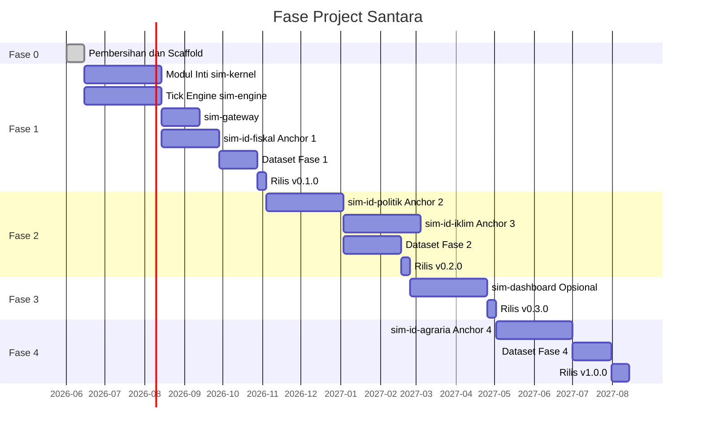

# Project Santara: Platform Microservice Counterfactual Sumber Terbuka untuk Simulasi Sistem Ekonomi, Politik, dan Iklim Indonesia

Dokumen ini adalah sumber kebenaran untuk apa yang sudah selesai, apa yang sedang berjalan, apa yang direncanakan, dan apa yang secara eksplisit aspirasional. Project Santara adalah platform microservice counterfactual sumber terbuka untuk simulasi sistem ekonomi, politik, dan iklim Indonesia. Target di bawah ini bukan komitmen. Itu adalah estimasi kerja tim sejak pembaruan terakhir.

Dokumen ini adalah sumber kebenaran untuk apa yang sudah selesai, apa yang sedang berjalan, apa yang direncanakan, dan apa yang secara eksplisit aspirasional. Dokumen ini jujur tentang status. Target di bawah ini bukan komitmen. Itu adalah estimasi kerja tim sejak pembaruan terakhir.

Versi Bahasa Inggris dari dokumen ini ada di [docs/ROADMAP.md](../docs/ROADMAP.md) dan bersifat kanonik. Jika keduanya berbeda, versi Bahasa Inggris yang menang.

## Daftar Isi

1. Versi Saat Ini
2. Ringkasan Fase
3. Fase 0: Pembersihan dan Scaffold
4. Fase 1: Engine Inti dan Anchor Pertama
5. Fase 2: Anchor Politik dan Iklim
6. Fase 3: Dashboard Opsional
7. Fase 4: Anchor Agraria
8. Beyond v1.0
9. Peta Jalan Dataset
10. Log Keputusan
11. Pertanyaan Terbuka
12. Di Luar Scope (v1.0)

## 1. Versi Saat Ini

**v0.0.0 (pre-alpha, 2026-06-15).** Codebase adalah scaffold saja. Struktur direktori sudah ada. File konfigurasi sudah dipublikasikan. Belum ada kode layanan yang ditulis. Lihat [CHANGELOG.md](../CHANGELOG.md) untuk entri reset v0.0.0.

Target rilis berikutnya adalah **v0.1.0**, yang mengirimkan `sim-kernel` dengan semua modul inti diimplementasi, `sim-engine` dengan server gRPC dan tick engine, `sim-gateway` dengan routing A2A dan hub MCP, dan `sim-id-fiskal` menjawab pertanyaan anchor pertama secara end to end.

## 2. Ringkasan Fase



Bagan Gantt adalah estimasi kerja, bukan kontrak. Fase bisa molor. Urutan fase lebih pasti dari tanggal.

## 3. Fase 0: Pembersihan dan Scaffold

**Status: selesai (2026-06-15).**

Fase 0 adalah reset penuh codebase. Tree `apps/` legacy, konfigurasi Nx, direktori `.docs/`, dan frontend TypeScript dihapus. Tree `services/` dan `libs/` baru dibuat dengan direktori scaffold, README, dan file konfigurasi. Set dokumentasi ditulis ulang dengan arsitektur baru. Gaya commit dan strategi rilis didokumentasikan.

### Deliverables Fase 0

- Semua file di entri v0.0.0 [CHANGELOG.md](../CHANGELOG.md).
- `docs/ARCHITECTURE.md` dan `docs-id/ARCHITECTURE.md` sebagai dokumen arsitektur kanonik.
- `docs/COMMIT_STYLE.md` dan root `RELEASE.md` sebagai standar operasional.
- `docs/AGENTS.md` sebagai panduan asisten AI.

### Definisi Selesai Fase 0

- [x] Tree `apps/` legacy dihapus.
- [x] Konfigurasi Nx dihapus.
- [x] Direktori `.docs/` dihapus.
- [x] Scaffold `services/sim-engine/` dengan `go.mod` dipublikasikan.
- [x] Scaffold `services/sim-gateway/`.
- [x] Scaffold `services/sim-id-fiskal/`.
- [x] Scaffold `services/sim-id-politik/`.
- [x] Scaffold `services/sim-id-iklim/`.
- [x] Scaffold `services/sim-id-agraria/`.
- [x] Scaffold `libs/sim-kernel/` dengan `pyproject.toml` dipublikasikan.
- [x] Scaffold `libs/rpc-contracts/`.
- [x] Root `Makefile` ditulis ulang sebagai layer convenience sederhana.
- [x] `docs/ARCHITECTURE.md` (Bahasa Inggris) dan `docs-id/ARCHITECTURE.md` (Bahasa Indonesia) diperbarui.
- [x] `README.md` dan `docs-id/PANDUAN.md` diperbarui.
- [x] `docs/COMMIT_STYLE.md` dibuat.
- [x] `RELEASE.md` dibuat.
- [x] `docs/AGENTS.md` dibuat.
- [x] Entri v0.0.0 `CHANGELOG.md` ditulis.
- [x] `CONTRIBUTING.md`, `CODE_OF_CONDUCT.md`, `SECURITY.md` diperbarui.

## 4. Fase 1: Engine Inti dan Anchor Pertama

**Status: sedang berjalan. Target waktu: 2026-06-15 sampai 2026-09-15.**

Fase 1 mengirimkan platform minimum yang layak. Setelah Fase 1, platform bisa menjawab pertanyaan anchor pertama secara end to end dengan waktu respons yang terukur.

### Deliverables Fase 1

- `libs/sim-kernel` dengan semua modul inti diimplementasi: `models`, `events`, `a2a`, `mcp`, `locales`, `prompts`, `telemetry`, `errors`, `grpc_contracts`. Stub Python untuk kontrak gRPC dihasilkan dari protobuf di `libs/rpc-contracts/`.
- `services/sim-engine` dengan server gRPC, tick engine, worker pool, state in-memory, dan telemetri zerolog. Binary `cmd/server` berjalan. Sebuah test integrasi kecil menguji tick engine dengan klien gRPC Python riil.
- `services/sim-gateway` dengan router A2A, hub server MCP, autentikasi JWT, dan dokumentasi OpenAPI. Gateway bisa merutekan pertanyaan ke `sim-id-fiskal` dan mengembalikan respons.
- `services/sim-id-fiskal` dengan stress test fiskal Indonesia. Layanan menjawab "Apa yang terjadi ke inflasi kalau Pertamax naik 30 persen lagi?" secara end to end. Jawaban berdasar pada data riil BI, Bapanas, dan DJBC.
- Stack Docker Compose yang menghadirkan `sim-engine`, `sim-gateway`, `sim-id-fiskal`, Redis, dan PostgreSQL dalam waktu di bawah 60 detik.
- Dataset Hugging Face Hub untuk Indonesia Fiscal Pressure Tracker, dengan `provenance.csv` dan `LICENSE-DATA`.
- Dataset Hugging Face Hub untuk Indonesia BPS Agricultural Time Series (ini dipakai bersama Fase 4, tapi loader di Fase 1).
- Rilis v0.1.0 dipublikasikan ke PyPI, GHCR, Hugging Face Hub, dan GitHub Releases.

### Definisi Selesai Fase 1

- [ ] Cakupan test `sim-kernel` di atau di atas 80 persen.
- [ ] Test integrasi `sim-engine` lulus dengan klien gRPC Python riil.
- [ ] `sim-gateway` bisa merutekan pertanyaan lewat A2A Protocol ke `sim-id-fiskal` dan kembali dalam waktu di bawah 30 detik.
- [ ] `sim-id-fiskal` menjawab pertanyaan anchor pertama secara end to end.
- [ ] Stack Docker Compose menghadirkan semua layanan dalam waktu di bawah 60 detik di laptop developer.
- [ ] Kartu dataset Hugging Face untuk Fiscal Pressure Tracker dipublikasikan.
- [ ] `make install` dan `make test` berhasil di clone baru.
- [ ] Pipeline rilis v0.1.0 (PyPI, GHCR, Hugging Face, GitHub Releases) berjalan end to end pada push tag.

## 5. Fase 2: Anchor Politik dan Iklim

**Status: direncanakan. Target waktu: 2026-09-15 sampai 2026-12-15.**

Fase 2 menambahkan layanan anchor kedua dan ketiga. Layanan-layanan ini mirip bentuknya dengan `sim-id-fiskal` tapi memodelkan sistem berbeda: dinamika politik (reshuffle kabinet, propagasi demo, skenario electoral) dan darurat iklim (projeksi El Nino, cascade karhutla, respons banjir).

### Deliverables Fase 2

- `services/sim-id-politik` dengan dinamika politik Indonesia. Layanan menjawab "Apa dampak MBG terhadap swing voter di 2029?" secara end to end.
- `services/sim-id-iklim` dengan darurat iklim Indonesia. Layanan menjawab "Kapan karhutla Riau menjadi krisis haze lintas batas?" secara end to end.
- Dataset Hugging Face Hub untuk Indonesia Political Event Log.
- Dataset Hugging Face Hub untuk Indonesia Climate and Disaster Log.
- Rilis v0.2.0.

### Definisi Selesai Fase 2

- [ ] `sim-id-politik` menjawab pertanyaan anchor kedua secara end to end.
- [ ] `sim-id-iklim` menjawab pertanyaan anchor ketiga secara end to end.
- [ ] Kedua dataset punya `provenance.csv` dan `LICENSE-DATA`.
- [ ] Semua item Definisi Selesai Fase 1 tetap hijau.
- [ ] Pipeline rilis v0.2.0 berjalan end to end.

## 6. Fase 3: Dashboard Opsional

**Status: direncanakan. Target waktu: 2026-12-15 sampai 2027-02-15.**

Fase 3 adalah dashboard web opsional. Dashboard adalah aplikasi TypeScript yang menggunakan React 19 dan Tailwind v4. Ini adalah satu-satunya permukaan TypeScript di platform. Dashboard bersifat opt-in: platform bekerja tanpanya.

### Deliverables Fase 3

- `services/sim-dashboard` dengan aplikasi React 19. Tailwind v4 untuk styling. Vite sebagai build tool. Dashboard bisa mengirim pertanyaan ke `sim-gateway` dan merender respons.
- Rilis v0.3.0.

### Definisi Selesai Fase 3

- [ ] `sim-dashboard` bisa mengirim pertanyaan dan merender respons.
- [ ] `sim-dashboard` dibuild menjadi bundle aset statis dan disajikan oleh `sim-gateway` (atau server statis terpisah).
- [ ] Dashboard tidak memperkenalkan framework server-side baru. Dia adalah klien statis.
- [ ] Semua item Definisi Selesai Fase 2 tetap hijau.
- [ ] Pipeline rilis v0.3.0 berjalan end to end.

## 7. Fase 4: Anchor Agraria

**Status: direncanakan. Target waktu: 2027-02-15 sampai 2027-05-15.**

Fase 4 menambahkan layanan anchor keempat dan terakhir. Mikro-ekonomi agraria adalah anchor yang paling kaya data: rantai tengkulak, skenario Reforma Agraria, perbandingan Koperasi Desa Merah Putih.

### Deliverables Fase 4

- `services/sim-id-agraria` dengan mikro-ekonomi agraria Indonesia. Layanan menjawab "Koperasi Desa Merah Putih vs tengkulak, mana yang lebih tinggi kesejahteraannya?" secara end to end.
- Dataset Hugging Face Hub untuk Indonesia Agrarian Conflict Map.
- Dataset Hugging Face Hub untuk Indonesia Fuel and Subsidy Tracker.
- Rilis v1.0.0, lini stabil pertama.

### Definisi Selesai Fase 4

- [ ] `sim-id-agraria` menjawab pertanyaan anchor keempat secara end to end.
- [ ] Kedua dataset punya `provenance.csv` dan `LICENSE-DATA`.
- [ ] Semua item Definisi Selesai Fase 1, 2, 3 tetap hijau.
- [ ] Pipeline rilis v1.0.0 berjalan end to end.
- [ ] Tabel versi yang didukung di `SECURITY.md` diperbarui untuk menandai 1.x sebagai lini stabil saat ini.

## 8. Beyond v1.0

Item-item ini secara eksplisit di luar scope v1.0 dan didaftar di sini agar kita tidak kehilangan jejak.

- **v1.5.0: Deployment multi-node.** Manifest K3s, container sidecar untuk relay outbox, replikasi PostgreSQL multi-region.
- **v1.5.0: Persistensi layanan Go.** Layanan Go saat ini berjalan in memory saja. Menambahkan persistensi PostgreSQL ke layanan Go adalah fitur v1.5.0.
- **v2.0.0: Capability token untuk autentikasi antar layanan.** Menggantikan mTLS di v1.0. Lebih fleksibel, lebih kompleks.
- **v2.0.0: Locale tambahan.** v1.0 mengirimkan ID, US, IN, PH. v2.0 mungkin menambahkan VN, TH, MM, BD, NG, KE, BR, MX.
- **v2.0.0: Gateway multi-tenant.** Satu instance `sim-gateway` bisa melayani banyak organisasi dengan kunci JWT dan rate limit terpisah.

## 9. Peta Jalan Dataset

Dataset terkurasi di-versioning secara independen dari platform. Setiap dataset punya repositori Hugging Face sendiri di bawah organisasi `raihanpka` (atau ekuivalen).

| Dataset | Sumber | Fase | Status |
|---|---|---|---|
| Indonesia Fiscal Pressure Tracker | Bank Indonesia, Bapanas PIHPS, DJBC, APBN | 1 | Direncanakan |
| Indonesia BPS Agricultural Time Series | BPS Sensus Pertanian 2023, satudata.pertanian.go.id, FAO FAOSTAT | 1 dan 4 | Direncanakan |
| Indonesia Political Event Log | BEM UI, BEM berbagai, media, KPU | 2 | Direncanakan |
| Indonesia Climate and Disaster Log | BMKG, BNPB, KLHK SiPongi, NOAA | 2 | Direncanakan |
| Indonesia Agrarian Conflict Map | KPA, Mongabay, Ekuatorial, Bisnis.com | 4 | Direncanakan |
| Indonesia Fuel and Subsidy Tracker | Pertamina, BPH Migas, ESDM | 4 | Direncanakan |

Setiap dataset dikirim bersama `provenance.csv` dan `LICENSE-DATA`. File provenance mencatat, untuk setiap baris, URL sumber, timestamp fetch, dan nama kolom asli. File lisensi mencatat lisensi sumber ketika bukan public domain. Loader menolak memuat dataset yang provenance-nya hilang atau yang lisensinya tidak kompatibel dengan distribusi platform.

## 10. Log Keputusan

Ringkasan keputusan paling penting dan rasionalnya. ADR terperinci ada di `docs/adr/`. Daftar bersifat append-only; membalikkan keputusan membutuhkan ADR baru.

| ID | Keputusan | Rasional | Tanggal |
|---|---|---|---|
| DEC-0001 | Mengadopsi hybrid microservices dengan tier intelligence Python dan tier performance Go. | Python adalah alat yang tepat untuk penalaran LLM, HTTP, A2A, MCP. Go adalah alat yang tepat untuk tick loop. Keduanya berkomunikasi lewat gRPC. | 2026-06-15 |
| DEC-0002 | Gunakan Apache 2.0 untuk kode baru. | Grant paten eksplisit, komersial friendly, cocok dengan standar open source. | 2026-06-15 |
| DEC-0003 | Tidak ada build tool monorepo di v1.0. | Setiap layanan adalah paket independen. Makefile hanya convenience. Hindari Nx, Turbo, Bazel, Lerna. | 2026-06-15 |
| DEC-0004 | A2A Protocol untuk komunikasi antar-Python, gRPC untuk Python ke Go, MCP untuk tool, Redis Streams untuk event. | Empat channel, masing-masing dengan tujuan jelas. Jangan perkenalkan channel kelima di v1.0. | 2026-06-15 |
| DEC-0005 | PostgreSQL per layanan, tidak ada join lintas layanan, tidak ada skema bersama. | Setiap layanan memiliki datanya sendiri. Pembagian data lintas layanan terjadi lewat A2A atau MCP, tidak pernah lewat database bersama. | 2026-06-15 |
| DEC-0006 | Dataset terkurasi di Hugging Face Hub, dengan provenance wajib. | Dataset adalah data publik riil. AI adalah kurator, bukan sumber. Provenance adalah jawaban untuk "kita mengarang angka." | 2026-06-15 |
| DEC-0007 | sim-kernel tidak mengandung I/O. Fungsi murni atau terima dependencies. | Library yang melakukan I/O adalah layanan, bukan library. Layanan bisa menjadi library dari logika bisnis tapi kernel adalah kontrak. | 2026-06-15 |
| DEC-0008 | Layanan Go berjalan in memory saja di v0.1.0. | Layanan Python memiliki state persisten. Layanan Go adalah simulator stateless. State persisten untuk layanan Go adalah fitur v1.5.0. | 2026-06-15 |
| DEC-0009 | Hapus tree `apps/` legacy dan konfigurasi Nx. | Arsitektur legacy tidak cocok dengan tujuan baru. Pelajaran yang dipetik dicatat di ARCHITECTURE.md dan ADR. | 2026-06-15 |
| DEC-0010 | Gunakan Mermaid untuk diagram di dokumentasi, bukan ASCII art. | GitHub merender Mermaid secara native. ASCII art tidak terbaca di code review. | 2026-06-15 |
| DEC-0011 | Tidak ada emoji, em dash, en dash di kode, komentar, atau dokumentasi. | Keterbacaan bilingual, aksesibilitas, rasio signal-ke-noise. | 2026-06-15 |

## 11. Pertanyaan Terbuka

Pertanyaan yang belum diputuskan tim, dengan tebakan terbaik saat ini dan tanggal untuk ditinjau ulang. OQ-0001 (pembaruan file LICENSE) diselesaikan pada 2026-06-15 dan dihapus dari tabel.

| ID | Pertanyaan | Tebakan Terbaik Saat Ini | Tinjau Ulang |
|---|---|---|---|
| OQ-0002 | Apakah sim-kernel satu paket atau monorepo sub-paket? | Satu paket. Daftar modul cukup kecil untuk hidup dalam satu paket. Jika daftar modul tumbuh melewati dua puluh, tinjau ulang. | v0.5.0 |
| OQ-0003 | Apakah layanan sim-engine memaparkan facade JSON-RPC untuk debugging? | Tidak. Gunakan `grpcurl` atau binary debug kecil. Menambahkan facade JSON-RPC menambah attack surface. | v1.0.0 |
| OQ-0004 | Apakah kita mengirimkan binary CLI bersama layanan Go? | Ya, sebagai subcommand `sim-engine` untuk menjalankan skenario secara lokal. CLI adalah binary `cmd/cli` terpisah, bukan server gRPC. | v0.2.0 |
| OQ-0005 | Apakah sim-gateway menggunakan Litestar atau FastAPI? | FastAPI. Komunitas lebih besar, dokumentasi lebih baik, dan Pydantic AI dibangun di atasnya. Litestar adalah alternatif yang baik tapi tidak menawarkan apa yang kita butuhkan. | v0.1.0 |
| OQ-0006 | Apakah kita mengadopsi OpenTelemetry Semantic Conventions untuk HTTP, RPC, dan database? | Ya. Konvensi cukup stabil. | v0.1.0 |
| OQ-0007 | Apakah sim-kernel mempublikasikan type stubs? | Ya, via marker `py.typed` dan type hint inline. Tidak ada paket `*-stubs` terpisah. | v0.1.0 |
| OQ-0008 | Apakah kita meng-host Hugging Face Space untuk platform? | Ya, di v0.2.0. Space adalah wrapper tipis di sekitar `sim-gateway` dengan kunci API publik. | v0.2.0 |

## 12. Di Luar Scope (v1.0)

Item-item ini secara eksplisit tidak ada di v1.0. Daftar ini bukan TODO. Ini adalah log penolakan. Kita tidak ingin ditanya untuk menambahkan item-item ini.

- **Aplikasi mobile.** Platform web-first. Mobile adalah fitur v2.0.
- **Skenario kolaboratif realtime.** Banyak pengguna menjalankan skenario bersama-sama. Ini memerlukan layer CRDT. Tidak di v1.0.
- **Input suara atau audio.** Platform menerima pertanyaan teks dalam Bahasa Inggris dan Bahasa Indonesia. Audio adalah fitur v2.0.
- **Auto-scaling di Kubernetes.** K3s dengan horizontal pod autoscaling adalah fitur v1.5.0.
- **SaaS hosted.** Platform self-hosted. SaaS multi-tenant hosted adalah fitur v2.0 atau lebih baru dan mungkin hidup di organisasi terpisah.
- **Mengganti Pydantic AI dengan framework agen lain.** Pydantic AI adalah framework yang dipilih. Penggantian adalah percakapan v2.0.
- **Mengganti layanan Go dengan implementasi Python, atau sebaliknya.** Hybrid adalah arsitekturnya. Jangan usulkan meruntuhkannya.
- **Mode "kita mengarang angka untuk membuat demo terlihat bagus."** Provenance dataset adalah jawaban untuk kritik itu. Platform tidak mengirimkan mode data palsu.

Jika fitur tidak ada di daftar ini dan tidak ada di rencana fase, itu belum diputuskan. Buka issue dengan label `proposal`.

## 13. Sitasi

Jika Anda merujuk Project Santara dalam karya akademis atau teknis, sitasi platform sebagai berikut.

```bibtex
@misc{project-santara-2026,
  author = {Raihan Putra Kirana},
  title  = {Project Santara: An Open-Source Counterfactual Microservices Platform for Simulating Indonesia's Economic, Political, and Climate Systems},
  year   = {2026},
  url    = {https://github.com/raihanpka/project-santara}
}
```
