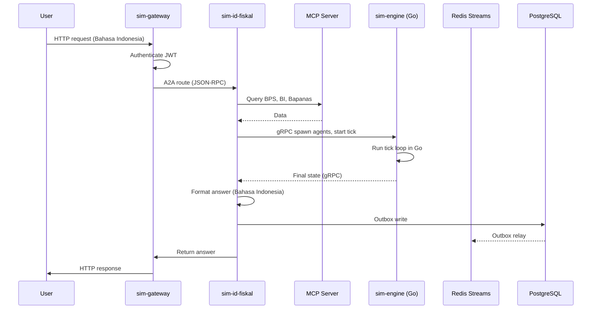

# Project Santara: An Open-Source Counterfactual Microservices Platform for Simulating Indonesia's Economic, Political, and Climate Systems

This document is the canonical source of truth for how Project Santara is built. It is honest about what is built today, what is being built, and what is aspirational. The project is under active development. The codebase is being rebuilt from scratch. The new structure under `services/` and `libs/` is scaffold only.

This document is the canonical source of truth for how Project Santara is built. It is honest about what is built today, what is being built, and what is aspirational. The project is under active development. The codebase is being rebuilt from scratch. The new structure under `services/` and `libs/` is scaffold only.

## Table of Contents

1. Philosophy
2. System Overview
3. Service Map
4. Repository Layout
5. Technology Stack
6. Data Flow
7. Cross-Service Communication
8. sim-kernel Library Specification
9. Bilingual and Locale Support
10. Persistence Model
11. Deployment
12. Security Model
13. Performance Targets
14. Testing Strategy
15. Observability
16. Architecture Decision Records
17. Curated Datasets

## 1. Philosophy

The architecture follows six rules.

- **Hybrid microservices, not monorepo.** Python services handle language-model reasoning and protocol exposure. A Go service handles the simulation tick loop. Each is an independent package with its own tests, its own Docker image, and its own deployment lifecycle.
- **Library first, service second.** The shared Python code lives in `sim-kernel`, a pip-installable library. The Go code is a separate module. The two communicate over gRPC.
- **Open standards, no proprietary wire format.** Services speak the A2A Protocol (Linux Foundation) for inter-service questions and the Model Context Protocol (Linux Foundation) for tool and data exposure. gRPC is used internally where the protocol has clear benefit.
- **Local-first by default.** Every service runs on a developer laptop with `docker compose up` in under 60 seconds. Cloud services are an opt-in convenience, never a requirement.
- **Bilingual code, not bilingual patches.** All user-facing strings, system prompts, and documentation live in both English and Bahasa Indonesia. Both languages are first class.
- **Honest about state.** This is an alpha project. Some sections of this document describe what is being built, not what is shipped. See ROADMAP.md for what is done, what is in progress, and what is aspirational.

## 2. System Overview

Project Santara is a small constellation of services in two tiers.

- **Intelligence tier (Python).** sim-gateway, sim-id-fiskal, sim-id-politik, sim-id-iklim, sim-id-agraria. These services handle HTTP, A2A, MCP, LLM reasoning, and data ingestion. Each is a FastAPI process with its own `pyproject.toml`.
- **Performance tier (Go).** sim-engine. This service runs the actual tick simulation. It owns agent state, market dynamics, and the worker pool. The Go service is a single Go module at `services/sim-engine/`.

The two tiers communicate over gRPC. The Python services do reasoning and orchestrate scenarios. The Go service does the hot loop. Both are necessary. The project is not a Python-only project or a Go-only project. It is a hybrid.

Persistence is PostgreSQL per service. There is no shared ORM, no cross-service joins, and no distributed transactions. Events flow over Redis Streams with the outbox pattern.

## 3. Service Map

```mermaid
flowchart TB
    subgraph Public["Public Clients"]
        Browser[Browser]
        Curl[curl]
        MCP_Client[MCP Client]
        A2A_Client[A2A Client]
    end

    subgraph Gateway["sim-gateway :8000 (Python, Phase 1)"]
        Gateway["A2A router, MCP hub, JWT auth,<br/>optional WebSocket telemetry"]
    end

    subgraph Intelligence["Intelligence Tier (Python)"]
        Fiskal["sim-id-fiskal :8001<br/>Phase 1, Anchor 1"]
        Politik["sim-id-politik :8002<br/>Phase 2, Anchor 2"]
        Iklim["sim-id-iklim :8003<br/>Phase 2, Anchor 3"]
        Agraria["sim-id-agraria :8004<br/>Phase 4, Anchor 4"]
    end

    subgraph Performance["Performance Tier (Go)"]
        Engine["sim-engine :50052 (Go)<br/>Phase 0 scaffold,<br/>tick engine, worker pool"]
    end

    subgraph Shared["Shared Library"]
        Kernel["sim-kernel (PyPI)<br/>Phase 0 scaffold, modules not yet implemented<br/>Pydantic models, events,<br/>MCP base, A2A base, locales"]
    end

    subgraph Infrastructure["Infrastructure"]
        Redis[("Redis 7<br/>Streams")]
        PG[("PostgreSQL 16<br/>per service")]
    end

    Browser --> Gateway
    Curl --> Gateway
    MCP_Client --> Gateway
    A2A_Client --> Gateway

    Gateway -->|A2A JSON-RPC| Fiskal
    Gateway -->|A2A JSON-RPC| Politik
    Gateway -->|A2A JSON-RPC| Iklim
    Gateway -->|A2A JSON-RPC| Agraria

    Fiskal -->|gRPC| Engine
    Politik -->|gRPC| Engine
    Iklim -->|gRPC| Engine
    Agraria -->|gRPC| Engine

    Fiskal -.->|uses| Kernel
    Politik -.->|uses| Kernel
    Iklim -.->|uses| Kernel
    Agraria -.->|uses| Kernel
    Gateway -.->|uses| Kernel

    Fiskal --> Redis
    Fiskal --> PG
    Politik --> PG
    Iklim --> PG
    Agraria --> PG
    Gateway --> PG
```

### Service Inventory

| Service | Language | Tier | Purpose | Default Port | Status |
|---|---|---|---|---|---|
| sim-kernel | Python (library) | Shared | Pydantic models, event schemas, MCP base, A2A base, locales | n/a | Phase 0 scaffold, `pyproject.toml` published, modules not yet implemented |
| sim-engine | Go | Performance | Tick simulation, agent state, market dynamics, worker pool, gRPC server | 50052 | Phase 0 scaffold, `go.mod` published, no Go code yet |
| sim-gateway | Python | Intelligence | A2A router, MCP server hub, JWT auth, WebSocket telemetry | 8000 | Phase 1, scaffold only |
| sim-id-fiskal | Python | Intelligence | Indonesia fiscal stress test (rupiah, BI rate, BBM, subsidi) | 8001 | Phase 1, scaffold only, first anchor problem |
| sim-id-politik | Python | Intelligence | Indonesia political dynamics (kabinet, demo, electoral) | 8002 | Phase 2, scaffold only |
| sim-id-iklim | Python | Intelligence | Indonesia climate emergency (El Nino, karhutla, banjir) | 8003 | Phase 2, scaffold only |
| sim-id-agraria | Python | Intelligence | Indonesia agrarian micro-economy (tengkulak, Reforma Agraria) | 8004 | Phase 4, scaffold only |
| sim-dashboard | TypeScript | Optional | React 19 and Tailwind v4 web UI | 3000 | Phase 3, not yet scaffold |

The v0.1.0 release ships sim-engine (with the gRPC server implemented), sim-kernel (with all modules implemented), sim-gateway, and sim-id-fiskal. The other sim-id services follow in Phase 2 and Phase 4. The dashboard is optional throughout.

## 4. Repository Layout

```mermaid
flowchart TB
    Root[project-santara/]
    Root --> Services[services/]
    Root --> Libs[libs/]
    Root --> Docs[docs/]
    Root --> DocsId[docs-id/]
    Root --> Readme[README.md]
    Root --> Contributing[CONTRIBUTING.md]
    Root --> Release[RELEASE.md]
    Root --> Coc[CODE_OF_CONDUCT.md]
    Root --> Security[SECURITY.md]
    Root --> Changelog[CHANGELOG.md]
    Root --> License[LICENSE]
    Root --> Makefile[Makefile]
    Docs --> AgentsMd[AGENTS.md]
    Docs --> ArchMd[ARCHITECTURE.md (this file)]
    Docs --> CommitStyle[COMMIT_STYLE.md]
    Docs --> RoadmapMd[ROADMAP.md]
    DocsId --> Panduan[PANDUAN.md]
```

The detailed layout for each service and library is in its own README at the root of that directory.

## 5. Technology Stack

The stack is chosen for maturity, hiring pool, and minimal ops footprint. Every technology has a written reason in the decision log in ROADMAP.md or in the ADRs.

### 5.1 Languages and Runtimes

- **Python 3.12** as the intelligence tier language. Pattern matching, type parameters, and the perf group are stable.
- **Go 1.22 or newer** as the performance tier language. The sim-engine code uses standard library and zerolog. No exotic dependencies.
- **TypeScript 5.x** only for the optional sim-dashboard. No other JavaScript.
- **SQL** for PostgreSQL queries. No ORM. The query layer uses `asyncpg` with raw SQL plus a thin repository helper.

### 5.2 Web and API

- **FastAPI** as the only Python web framework. Pydantic v2 is used for request and response models.
- **Uvicorn** as the ASGI server. Gunicorn is not used.
- **gRPC** for the Python to Go boundary. Protobuf contracts in `libs/rpc-contracts/proto/simulation.proto`. The Go service is the gRPC server; the Python services are the gRPC clients.
- **HTTPX** for internal HTTP and integration tests.

### 5.3 Agent and LLM

- **Pydantic AI** for type-safe agent definitions. OTel native, MCP and A2A client built in.
- **Sahabat-AI** as the default Bahasa Indonesia model. Open source on Hugging Face.
- **Llama 4 8B Instruct** as the default local model. Runs on a single consumer GPU.
- **Anthropic Claude and OpenAI GPT** as opt-in cloud providers for advanced reasoning. API key only.

### 5.4 Simulation

- **Mesa 4.0** as the Python agent-based modeling framework. Optional, used for research-grade analysis after the Go tick engine runs.
- **Custom Go tick engine** at `services/sim-engine/`. Atomic counters, worker pool, in-memory state, gRPC server. The Go service is the only one that runs ticks.
- **Pandas** for data analysis in post-mortem reports.
- **NumPy** for numerical simulation primitives.

### 5.5 Inter-Service Communication

- **A2A Protocol v1.0.1** for synchronous inter-service questions between Python services. Linux Foundation standard. Transport is JSON-RPC over HTTP.
- **Model Context Protocol** with Streamable HTTP transport and OAuth 2.1 for tool and data exposure. Linux Foundation standard.
- **gRPC** for the Python to Go boundary. Protobuf-defined contracts. Lower latency than JSON-RPC, strong typing.
- **Redis Streams** for asynchronous events between Python services. Outbox pattern in each service to guarantee at-least-once delivery.

### 5.6 Data and State

- **PostgreSQL 16** as the only persistent store. One database per service. No cross-database joins.
- **Redis 7** for Streams, ephemeral locks, and short-lived session state. No long-term storage.
- **asyncpg** as the PostgreSQL driver for Python.
- **redis-py** as the Redis client.
- **Pydantic v2** for all Python data models, including database row models.
- **Go database/sql** with the pgx driver for the Go service, if it ever needs to persist state. Currently in-memory only.

### 5.7 Deployment

- **Docker** and **Docker Compose** for local development and single-node deployment.
- **K3s** as the recommended multi-node orchestrator. No full Kubernetes in v1.0.
- **GHCR** (GitHub Container Registry) for public image hosting.
- **PyPI** for sim-kernel distribution.
- **Hugging Face Hub** for curated dataset distribution. See section 17.

### 5.8 Observability

- **OpenTelemetry** for traces, metrics, and logs. Every service uses the OTel SDK.
- **zerolog** for structured Go logging.
- **Structlog** for structured Python logging.
- **Grafana** for dashboards. Loki for logs. Tempo for traces. Prometheus for metrics.
- **Sentry** as opt-in for error reporting. Disabled by default for privacy.

### 5.9 Testing

- **pytest** for Python unit and integration tests.
- **pytest-asyncio** for async test cases.
- **httpx** for async HTTP testing.
- **respx** for mocking external HTTP calls in tests.
- **Go testing** standard library and testify for the Go service.
- **coverage** for Python code coverage, enforced at 80 percent on sim-kernel and 70 percent on each Python service.
- Coverage on the Go service is not enforced as a hard gate. The integration tests exercise the Go tick engine end to end with a real Python gRPC caller.

### 5.10 Bilingual Locale

- **PyYAML** for loading locale presets.
- **Babel** for message catalog management if translation volume grows.
- **Locale data files** in sim-kernel for ID, US, IN, PH in v1.0, with hooks for adding more.

## 6. Data Flow

The canonical end-to-end flow is a fiscal stress test scenario. A user asks in Bahasa Indonesia: "Apa yang terjadi ke inflasi kalau Pertamax naik 30 persen lagi?"



The full path is target less than 30 seconds for a single scenario. This is a target, not a measured result.

## 7. Cross-Service Communication

Four channels, four rules.

- **A2A for questions between Python services.** Use the A2A Protocol when one Python service needs an answer from another Python service. Transport is JSON-RPC over HTTP. Each service publishes a static Agent Card at `/.well-known/agent-card.json`.
- **MCP for tools and data.** Use the Model Context Protocol when a service exposes tools or data to agents (human or machine). Each service publishes its MCP server at `/mcp`.
- **gRPC for the Python to Go boundary.** Use gRPC when a Python service needs the Go tick engine. The protobuf contracts are in `libs/rpc-contracts/proto/simulation.proto`.
- **Redis Streams for events.** Use Redis Streams for fire-and-forget events between Python services. The outbox pattern guarantees at-least-once delivery. Consumers must be idempotent.

Do not introduce a fifth channel in v1.0. The discipline matters more than the convenience.

## 8. sim-kernel Library Specification

sim-kernel is the only Python library every service depends on. It is pip-installable as `sim-kernel`. It contains no I/O of its own. Every function is pure or accepts its dependencies as arguments.

### Public Modules

| Module | Purpose |
|---|---|
| sim_kernel.models | Pydantic models for the core domain (Agent, Market, Region, Event, FiscalShock, PoliticalShock, ClimateShock) |
| sim_kernel.events | Event envelope, event bus helpers, outbox pattern helpers |
| sim_kernel.a2a | AgentCard generator, A2A client, A2A server base |
| sim_kernel.mcp | MCPServerBase, tool decorator, JSON schema helpers |
| sim_kernel.locales | Locale presets for ID, US, IN, PH, with currency and admin level names |
| sim_kernel.prompts | Bahasa Indonesia and English system prompt templates for agent roles |
| sim_kernel.telemetry | OpenTelemetry tracer and meter helpers |
| sim_kernel.errors | Standard error slugs (ErrAgentNotFound, ErrSimFailed, and so on) |
| sim_kernel.grpc_contracts | Python stubs generated from the protobuf contracts |

### Versioning

sim-kernel follows Semantic Versioning strictly. Breaking changes require a major version bump. Services pin to a minor version range, never a major range.

## 9. Bilingual and Locale Support

Every user-facing string lives in two places: the English source and the Bahasa Indonesia translation. The translation file is checked in alongside the source. Locale presets live in sim-kernel and are loaded at service startup.

A service can answer in three languages: English (default), Bahasa Indonesia (id), and the language of the user's request. The system prompt is loaded from sim-kernel.prompts using the user's locale.

The English version of internal docs is in `docs/`. The Bahasa Indonesia version is in `docs-id/`. Both directories are kept in sync.

## 10. Persistence Model

Each service owns its own PostgreSQL database. Cross-service joins are forbidden. Cross-service data sharing happens through A2A or MCP, never through a shared database.

The outbox pattern is mandatory for any state change that needs to produce an event. The state change and the outbox row are written in the same transaction. A relay process reads the outbox and publishes to Redis Streams.

Migrations are managed with plain SQL files in `migrations/` per service. No Alembic, no Prisma, no Flyway. The migration runner is a small script in sim-kernel.

The Go service currently runs in memory only. Persistent state for the Go service is a v1.5.0 feature. If the Go service crashes mid-simulation, the simulation is lost. This is acceptable for now because the Python services own the durable state and the Go service is treated as a stateless simulator.

## 11. Deployment

### Local Development

```
docker compose up
```

This brings up the v0.1.0 services plus Redis and PostgreSQL. The full boot takes target under 60 seconds on a developer laptop with Docker Desktop. Actual boot time is not yet measured.

### Single-Node Production

The same Docker Compose file, with one environment file change, runs on a single VPS. Recommended VPS is 4 vCPU, 8 GB RAM, 80 GB SSD. Cost target is under USD 30 per month from any major cloud provider. This is a target, not a measured result.

### Multi-Node Production

K3s is the recommended orchestrator. Each service ships a Kubernetes manifest. The outbox relay and the MCP hub run as sidecar containers. This is a v1.5.0 feature.

## 12. Security Model

- **JWT** at the gateway for user authentication. RS256 with rotating keys.
- **OAuth 2.1** for the MCP server when accessed by third-party clients.
- **mTLS** for inter-service traffic in v1.0. Capability tokens in v2.0.
- **No secrets in environment variables in production.** Secrets are loaded from Docker secrets or a secret manager.
- **License allows commercial use.** Apache 2.0 is permissive enough for any reasonable integration, with an explicit patent grant. The full license text is in the LICENSE file at the repository root.

## 13. Performance Targets

These are targets, not measured results.

| Metric | Target | Status |
|---|---|---|
| Single scenario response (fiscal) | Less than 30 seconds end to end | Not yet measured |
| A2A inter-service call | Less than 500 milliseconds p95 | Not yet measured |
| MCP tool invocation | Less than 200 milliseconds p95 | Not yet measured |
| gRPC call to Go service | Less than 50 milliseconds p95 | Not yet measured |
| Go tick engine throughput | At least 1,000 ticks per second single agent | Not yet measured |
| Concurrent simulations per node | At least 10 | Not yet measured |
| Memory per Python service | Less than 512 MB steady state | Not yet measured |
| Memory per Go service | Less than 256 MB steady state | Not yet measured |
| Cold start | Less than 5 seconds | Not yet measured |

Targets are aspirational. We will measure and update this table as the project stabilizes.

## 14. Testing Strategy

Three layers.

- **Unit tests** for pure functions. Coverage target 80 percent on sim-kernel, 70 percent on Python services.
- **Integration tests** for service boundaries. Use httpx against a local Docker Compose stack. No external API calls in tests.
- **End-to-end scenario tests** that ship with the service. Each scenario is a runnable Python file that proves the service answers a real question.

For the Go service, integration tests exercise the gRPC server end to end with a real Python gRPC client. The Python caller is a small test harness, not a production service.

Test data is shipped as fixtures, never generated at test time. Tests must be reproducible by anyone with the repository.

## 15. Observability

Every service emits three signals: structured logs, OpenTelemetry traces, and Prometheus metrics. The defaults are: log level INFO, trace sampling 1.0 in dev, 0.1 in production.

Three dashboards ship with the platform.

- **Service health.** Request rate, error rate, p50, p95, p99 latency, memory, CPU.
- **Simulation health.** Scenarios per minute, scenarios failed, A2A call p95, MCP tool p95.
- **Business metrics.** Scenario distribution by region, by user, by anchor problem.

The dashboards are not yet implemented. The OTel SDK will be wired in each service as it is implemented.

## 16. Architecture Decision Records

Architecture decisions are tracked in `docs/adr/` as numbered Markdown files (0001-record-architecture.md, 0002-choose-pydantic-ai.md, and so on). Each ADR has the same five sections: Context, Decision, Consequences, Alternatives, References. ADRs are append-only. Reversing a decision requires a new ADR.

The current decision log summary is in `ROADMAP.md`. The detailed reasoning lives in the ADRs themselves.

## 17. Curated Datasets

The platform ships curated, non-AI-generated datasets on the Hugging Face Hub. These datasets exist to make the simulations reproducible and to let external researchers verify the platform's claims.

### Approach

- **The data is real.** Every row in a Santara dataset can be traced to a named public source. No values are imputed by an LLM.
- **AI acts as curator.** An AI assistant (or a human using an AI assistant) discovers the source, validates the schema, cleans the formatting, and writes the loader. The AI does not invent values.
- **Provenance is mandatory.** Every dataset has a `provenance.csv` companion that records, for each row, the source URL, the fetch timestamp, and the original column names. The loader verifies provenance at load time and refuses to load if the provenance is missing.
- **License is preserved.** If a source has a non-redistribution license, the dataset ships with a `LICENSE-DATA` file that names the source and its license.

### Planned Datasets

| Dataset | Source | Status |
|---|---|---|
| Indonesia Fiscal Pressure Tracker | Bank Indonesia, Bapanas PIHPS, DJBC, APBN | Planned (Phase 1) |
| Indonesia BPS Agricultural Time Series | BPS Sensus Pertanian 2023, satudata.pertanian.go.id, FAO FAOSTAT | Planned (Phase 1) |
| Indonesia Political Event Log | BEM UI, BEM various, media outlets, KPU | Planned (Phase 2) |
| Indonesia Climate and Disaster Log | BMKG, BNPB, KLHK SiPongi, NOAA | Planned (Phase 2) |
| Indonesia Agrarian Conflict Map | KPA, Mongabay, Ekuatorial, Bisnis.com | Planned (Phase 4) |
| Indonesia Fuel and Subsidy Tracker | Pertamina, BPH Migas, ESDM | Planned (Phase 4) |

The datasets are deployed under the `raihanpka` (or equivalent) Hugging Face organization. The deployment process is a Python script in `libs/sim-datasets/` that fetches, validates, packages, and pushes to the Hub. See [RELEASE.md](../../RELEASE.md) for the full distribution strategy.

### Why This Matters

A common critique of simulation platforms is "we made up the numbers to make the demo look good." The dataset publication is the answer to that critique. Anyone with the dataset can run their own simulation, verify the platform's numbers, and publish their own critique or improvement.

This is also how the platform earns trust over time. Trust is not a marketing claim. Trust is a record of being checked and not being wrong.

## 18. Citation

If you reference Project Santara in academic or technical work, cite the platform as follows.

```bibtex
@misc{project-santara-2026,
  author = {Raihan Putra Kirana},
  title  = {Project Santara: An Open-Source Counterfactual Microservices Platform for Simulating Indonesia's Economic, Political, and Climate Systems},
  year   = {2026},
  url    = {https://github.com/raihanpka/project-santara}
}
```
