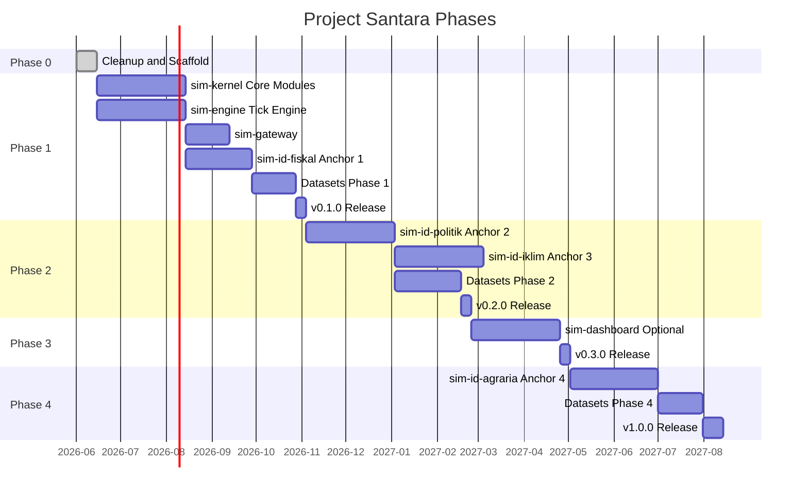

# Project Santara: An Open-Source Counterfactual Microservices Platform for Simulating Indonesia's Economic, Political, and Climate Systems

This document is the source of truth for what is done, what is in progress, what is planned, and what is explicitly aspirational. Project Santara is an open-source counterfactual microservices platform for simulating Indonesia's economic, political, and climate systems. Targets below are not commitments. They are the team's working estimate as of the most recent update.

The English version of this file is canonical. The Bahasa Indonesia version lives in [docs-id/ROADMAP.md](./docs-id/ROADMAP.md). If the two diverge, the English version wins.

## Table of Contents

1. Current Version
2. Phases Overview
3. Phase 0: Cleanup and Scaffold
4. Phase 1: Core Engine and First Anchor
5. Phase 2: Political and Climate Anchors
6. Phase 3: Optional Dashboard
7. Phase 4: Agrarian Anchor
8. Beyond v1.0
9. Dataset Roadmap
10. Decision Log
11. Open Questions
12. Out of Scope (v1.0)

## 1. Current Version

**v0.0.0 (pre-alpha, 2026-06-15).** The codebase is scaffold only. The directory structure exists. The configuration files are published. No service code has been written. See [CHANGELOG.md](../CHANGELOG.md) for the v0.0.0 reset entry.

The next release target is **v0.1.0**, which ships `sim-kernel` with all core modules implemented, `sim-engine` with the gRPC server and the tick engine, `sim-gateway` with A2A routing and the MCP hub, and `sim-id-fiskal` answering the first anchor question end to end.

## 2. Phases Overview



The Gantt chart is a working estimate, not a contract. Phases may slip. The order of phases is firmer than the dates.

## 3. Phase 0: Cleanup and Scaffold

**Status: complete (2026-06-15).**

Phase 0 was the full reset of the codebase. The legacy `apps/` tree, the Nx configuration, the `.docs/` directory, and the TypeScript frontend were removed. The new `services/` and `libs/` trees were created with scaffold directories, READMEs, and configuration files. The documentation set was rewritten with the new architecture. The commit style and release strategy were documented.

### Phase 0 Deliverables

- All files in [CHANGELOG.md](../CHANGELOG.md) v0.0.0 entry.
- `docs/ARCHITECTURE.md` and `docs-id/ARCHITECTURE.md` as the canonical architecture documents.
- `docs/COMMIT_STYLE.md` and root `RELEASE.md` as the operational standards.
- `docs/AGENTS.md` as the AI assistant guide.

### Phase 0 Definition of Done

- [x] Legacy `apps/` tree removed.
- [x] Nx configuration removed.
- [x] `.docs/` directory removed.
- [x] `services/sim-engine/` scaffold with `go.mod` published.
- [x] `services/sim-gateway/` scaffold.
- [x] `services/sim-id-fiskal/` scaffold.
- [x] `services/sim-id-politik/` scaffold.
- [x] `services/sim-id-iklim/` scaffold.
- [x] `services/sim-id-agraria/` scaffold.
- [x] `libs/sim-kernel/` scaffold with `pyproject.toml` published.
- [x] `libs/rpc-contracts/` scaffold.
- [x] Root `Makefile` rewritten as a simple convenience layer.
- [x] `docs/ARCHITECTURE.md` (English) and `docs-id/ARCHITECTURE.md` (Indonesian) updated.
- [x] `README.md` and `docs-id/PANDUAN.md` updated.
- [x] `docs/COMMIT_STYLE.md` created.
- [x] `RELEASE.md` created.
- [x] `docs/AGENTS.md` created.
- [x] `CHANGELOG.md` v0.0.0 entry written.
- [x] `CONTRIBUTING.md`, `CODE_OF_CONDUCT.md`, `SECURITY.md` updated.

## 4. Phase 1: Core Engine and First Anchor

**Status: in progress. Target window: 2026-06-15 to 2026-09-15.**

Phase 1 ships the minimum viable platform. After Phase 1, the platform can answer the first anchor question end to end with a measurable response time.

### Phase 1 Deliverables

- `libs/sim-kernel` with all core modules implemented: `models`, `events`, `a2a`, `mcp`, `locales`, `prompts`, `telemetry`, `errors`, `grpc_contracts`. The Python stubs for the gRPC contracts are generated from the protobuf in `libs/rpc-contracts/`.
- `services/sim-engine` with the gRPC server, the tick engine, the worker pool, the in-memory state, and the zerolog telemetry. The `cmd/server` binary runs. A small integration test exercises the tick engine with a real Python gRPC client.
- `services/sim-gateway` with the A2A router, the MCP server hub, JWT auth, and OpenAPI documentation. The gateway can route a question to `sim-id-fiskal` and stream the response back.
- `services/sim-id-fiskal` with the Indonesia fiscal stress test. The service answers "Apa yang terjadi ke inflasi kalau Pertamax naik 30 persen lagi?" end to end. The answer is grounded in real BI, Bapanas, and DJBC data.
- Docker Compose stack that brings up `sim-engine`, `sim-gateway`, `sim-id-fiskal`, Redis, and PostgreSQL in under 60 seconds.
- Hugging Face Hub dataset for the Indonesia Fiscal Pressure Tracker, with `provenance.csv` and `LICENSE-DATA`.
- Hugging Face Hub dataset for the Indonesia BPS Agricultural Time Series (this is shared with Phase 4, but the loader is in Phase 1).
- v0.1.0 release published to PyPI, GHCR, Hugging Face Hub, and GitHub Releases.

### Phase 1 Definition of Done

- [ ] `sim-kernel` test coverage at or above 80 percent.
- [ ] `sim-engine` integration test passes against a real Python gRPC client.
- [ ] `sim-gateway` can route a question through the A2A Protocol to `sim-id-fiskal` and back in under 30 seconds.
- [ ] `sim-id-fiskal` answers the first anchor question end to end.
- [ ] Docker Compose stack brings up all services in under 60 seconds on a developer laptop.
- [ ] Hugging Face dataset card for the Fiscal Pressure Tracker is published.
- [ ] `make install` and `make test` succeed in a fresh clone.
- [ ] v0.1.0 release pipeline (PyPI, GHCR, Hugging Face, GitHub Releases) runs end to end on a tag push.

## 5. Phase 2: Political and Climate Anchors

**Status: planned. Target window: 2026-09-15 to 2026-12-15.**

Phase 2 adds the second and third anchor services. These services are similar in shape to `sim-id-fiskal` but model different systems: political dynamics (kabinet reshuffle, demo propagation, electoral scenarios) and climate emergency (El Nino projection, karhutla cascade, banjir response).

### Phase 2 Deliverables

- `services/sim-id-politik` with the Indonesia political dynamics. The service answers "Apa dampak MBG terhadap swing voter di 2029?" end to end.
- `services/sim-id-iklim` with the Indonesia climate emergency. The service answers "Kapan karhutla Riau menjadi krisis haze lintas batas?" end to end.
- Hugging Face Hub dataset for the Indonesia Political Event Log.
- Hugging Face Hub dataset for the Indonesia Climate and Disaster Log.
- v0.2.0 release.

### Phase 2 Definition of Done

- [ ] `sim-id-politik` answers the second anchor question end to end.
- [ ] `sim-id-iklim` answers the third anchor question end to end.
- [ ] Both datasets have `provenance.csv` and `LICENSE-DATA`.
- [ ] All Phase 1 Definition of Done items remain green.
- [ ] v0.2.0 release pipeline runs end to end.

## 6. Phase 3: Optional Dashboard

**Status: planned. Target window: 2026-12-15 to 2027-02-15.**

Phase 3 is the optional web dashboard. The dashboard is a TypeScript application using React 19 and Tailwind v4. It is the only TypeScript surface in the platform. The dashboard is opt-in: the platform works without it.

### Phase 3 Deliverables

- `services/sim-dashboard` with a React 19 application. Tailwind v4 for styling. Vite as the build tool. The dashboard can send questions to `sim-gateway` and render the responses.
- v0.3.0 release.

### Phase 3 Definition of Done

- [ ] `sim-dashboard` can send a question and render the response.
- [ ] `sim-dashboard` is built into a static asset bundle and served by `sim-gateway` (or a separate static server).
- [ ] The dashboard does not introduce a new server-side framework. It is a static client.
- [ ] All Phase 2 Definition of Done items remain green.
- [ ] v0.3.0 release pipeline runs end to end.

## 7. Phase 4: Agrarian Anchor

**Status: planned. Target window: 2027-02-15 to 2027-05-15.**

Phase 4 adds the fourth and final anchor service. The agrarian micro-economy is the most data-rich anchor: tengkulak chain, Reforma Agraria scenarios, Koperasi Desa Merah Putih comparison.

### Phase 4 Deliverables

- `services/sim-id-agraria` with the Indonesia agrarian micro-economy. The service answers "Koperasi Desa Merah Putih vs tengkulak, mana yang lebih tinggi kesejahteraannya?" end to end.
- Hugging Face Hub dataset for the Indonesia Agrarian Conflict Map.
- Hugging Face Hub dataset for the Indonesia Fuel and Subsidy Tracker.
- v1.0.0 release, the first stable line.

### Phase 4 Definition of Done

- [ ] `sim-id-agraria` answers the fourth anchor question end to end.
- [ ] Both datasets have `provenance.csv` and `LICENSE-DATA`.
- [ ] All Phase 1, 2, 3 Definition of Done items remain green.
- [ ] v1.0.0 release pipeline runs end to end.
- [ ] The supported versions table in `SECURITY.md` is updated to mark 1.x as the current stable line.

## 8. Beyond v1.0

These items are explicitly out of scope for v1.0 and are listed here so we do not lose them.

- **v1.5.0: Multi-node deployment.** K3s manifests, sidecar containers for the outbox relay, multi-region PostgreSQL replication.
- **v1.5.0: Go service persistence.** The Go service currently runs in memory only. Adding PostgreSQL persistence to the Go service is a v1.5.0 feature.
- **v2.0.0: Capability tokens for inter-service auth.** Replaces mTLS in v1.0. More flexible, more complex.
- **v2.0.0: Additional locales.** The v1.0 ships ID, US, IN, PH. The v2.0 may add VN, TH, MM, BD, NG, KE, BR, MX.
- **v2.0.0: Multi-tenant gateway.** A single `sim-gateway` instance can serve multiple organizations with separate JWT keys and rate limits.

## 9. Dataset Roadmap

The curated datasets are versioned independently of the platform. Each dataset has its own Hugging Face repository under the `raihanpka` (or equivalent) organization.

| Dataset | Source | Phase | Status |
|---|---|---|---|
| Indonesia Fiscal Pressure Tracker | Bank Indonesia, Bapanas PIHPS, DJBC, APBN | 1 | Planned |
| Indonesia BPS Agricultural Time Series | BPS Sensus Pertanian 2023, satudata.pertanian.go.id, FAO FAOSTAT | 1 and 4 | Planned |
| Indonesia Political Event Log | BEM UI, BEM various, media outlets, KPU | 2 | Planned |
| Indonesia Climate and Disaster Log | BMKG, BNPB, KLHK SiPongi, NOAA | 2 | Planned |
| Indonesia Agrarian Conflict Map | KPA, Mongabay, Ekuatorial, Bisnis.com | 4 | Planned |
| Indonesia Fuel and Subsidy Tracker | Pertamina, BPH Migas, ESDM | 4 | Planned |

Every dataset ships with `provenance.csv` and `LICENSE-DATA`. The provenance file records, for each row, the source URL, the fetch timestamp, and the original column names. The license file records the source license when it is not public domain. The loader refuses to load a dataset whose provenance is missing or whose license is not compatible with the platform's distribution.

## 10. Decision Log

A summary of the most important decisions and their rationale. The detailed ADRs live in `docs/adr/`. The list is append-only; reversing a decision requires a new ADR.

| ID | Decision | Rationale | Date |
|---|---|---|---|
| DEC-0001 | Adopt hybrid microservices with Python intelligence tier and Go performance tier. | Python is the right tool for LLM reasoning, HTTP, A2A, MCP. Go is the right tool for the tick loop. The two communicate over gRPC. | 2026-06-15 |
| DEC-0002 | Use Apache 2.0 for new code. | Explicit patent grant, commercial friendly, matches the open-source standard. | 2026-06-15 |
| DEC-0003 | No monorepo build tool in v1.0. | Each service is an independent package. The Makefile is convenience only. Avoid Nx, Turbo, Bazel, Lerna. | 2026-06-15 |
| DEC-0004 | A2A Protocol for inter-Python communication, gRPC for Python to Go, MCP for tools, Redis Streams for events. | Four channels, each with a clear purpose. Do not introduce a fifth channel in v1.0. | 2026-06-15 |
| DEC-0005 | PostgreSQL per service, no cross-service joins, no shared schema. | Each service owns its data. Cross-service data sharing happens through A2A or MCP, never through a shared database. | 2026-06-15 |
| DEC-0006 | Curated datasets on Hugging Face Hub, with mandatory provenance. | Datasets are real public data. AI is a curator, not a source. Provenance is the answer to "we made up the numbers." | 2026-06-15 |
| DEC-0007 | sim-kernel contains no I/O. Pure functions or accept dependencies. | A library that does I/O is a service, not a library. Services can be libraries of business logic but the kernel is the contract. | 2026-06-15 |
| DEC-0008 | The Go service runs in memory only in v0.1.0. | The Python services own the durable state. The Go service is a stateless simulator. Persistent state for the Go service is a v1.5.0 feature. | 2026-06-15 |
| DEC-0009 | Delete the legacy `apps/` tree and the Nx configuration. | The legacy architecture does not match the new goals. The lessons learned are recorded in ARCHITECTURE.md and the ADRs. | 2026-06-15 |
| DEC-0010 | Use Mermaid for diagrams in documentation, not ASCII art. | GitHub renders Mermaid natively. ASCII art is unreadable in code review. | 2026-06-15 |
| DEC-0011 | No emoji, no em dash, no en dash in code, comments, or documentation. | Bilingual readability, accessibility, signal-to-noise ratio. | 2026-06-15 |

## 11. Open Questions

Questions that the team has not yet decided, with the current best guess and a date for revisiting. OQ-0001 (LICENSE file update) was resolved on 2026-06-15 and removed from the table.

| ID | Question | Current Best Guess | Revisit |
|---|---|---|---|
| OQ-0002 | Should sim-kernel be a single package or a monorepo of sub-packages? | Single package. The module list is small enough to live in one package. If the module list grows past twenty, revisit. | v0.5.0 |
| OQ-0003 | Should the sim-engine service expose a JSON-RPC facade for debugging? | No. Use `grpcurl` or a small debug binary. Adding a JSON-RPC facade adds an attack surface. | v1.0.0 |
| OQ-0004 | Should we ship a CLI binary alongside the Go service? | Yes, as a `sim-engine` subcommand for running scenarios locally. The CLI is a separate `cmd/cli` binary, not the gRPC server. | v0.2.0 |
| OQ-0005 | Should sim-gateway use Litestar or FastAPI? | FastAPI. The community is larger, the documentation is better, and Pydantic AI is built on it. Litestar is a fine alternative but offers nothing we need. | v0.1.0 |
| OQ-0006 | Should we adopt OpenTelemetry Semantic Conventions for HTTP, RPC, and database? | Yes. The conventions are stable enough. | v0.1.0 |
| OQ-0007 | Should sim-kernel publish type stubs? | Yes, via `py.typed` marker and inline type hints. No separate `*-stubs` package. | v0.1.0 |
| OQ-0008 | Should we host a Hugging Face Space for the platform? | Yes, in v0.2.0. The Space is a thin wrapper around `sim-gateway` with a public API key. | v0.2.0 |

## 12. Out of Scope (v1.0)

These items are explicitly not in v1.0. The list is not a TODO. It is a refusal log. We do not want to be asked to add these items.

- **Mobile applications.** The platform is web-first. Mobile is a v2.0 feature.
- **Realtime collaborative scenarios.** Multiple users running a scenario together. This requires a CRDT layer. Not in v1.0.
- **Voice or audio input.** The platform accepts text questions in English and Bahasa Indonesia. Audio is a v2.0 feature.
- **Auto-scaling on Kubernetes.** K3s with horizontal pod autoscaling is a v1.5.0 feature.
- **Hosted SaaS.** The platform is self-hosted. A hosted multi-tenant SaaS is a v2.0 or later feature and may live in a separate organization.
- **Replacing Pydantic AI with another agent framework.** Pydantic AI is the chosen framework. Switching is a v2.0 conversation.
- **Replacing the Go service with a Python implementation, or vice versa.** The hybrid is the architecture. Do not propose collapsing it.
- **A "we made up the numbers to make the demo look good" mode.** The dataset provenance is the answer to that critique. The platform does not ship a fake-data mode.

If a feature is not on this list and not in the phase plan, it is undecided. Open an issue with the `proposal` label.

## 13. Citation

If you reference Project Santara in academic or technical work, cite the platform as follows.

```bibtex
@misc{project-santara-2026,
  author = {Raihan Putra Kirana},
  title  = {Project Santara: An Open-Source Counterfactual Microservices Platform for Simulating Indonesia's Economic, Political, and Climate Systems},
  year   = {2026},
  url    = {https://github.com/raihanpka/project-santara}
}
```
